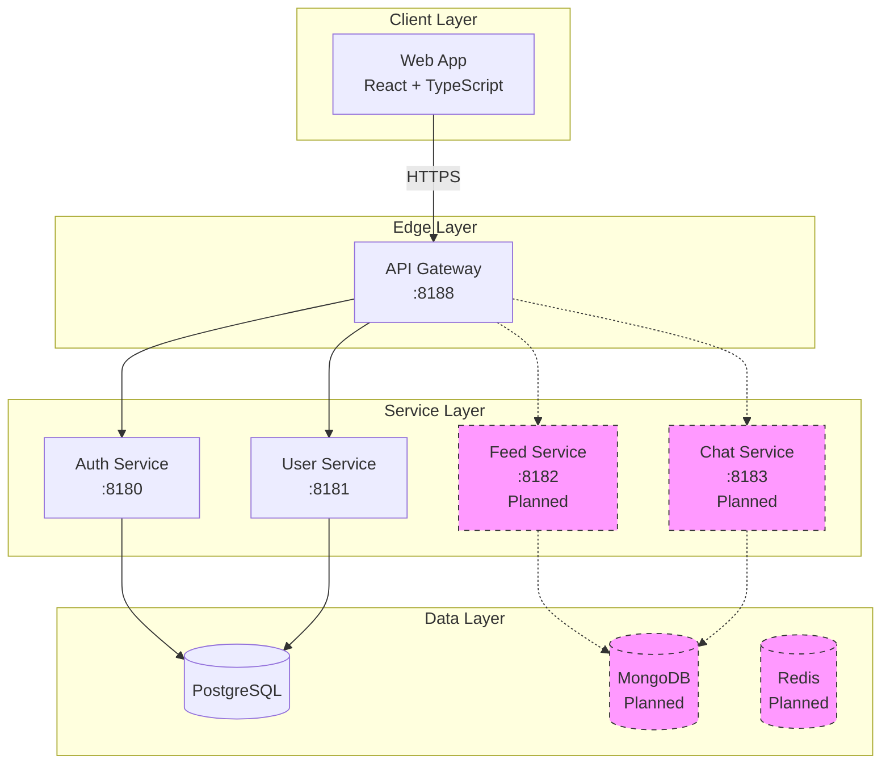

# DayPulse Documentation

> A modern social networking platform built with microservices architecture

Welcome to the DayPulse documentation! This guide will help you understand, build, and deploy the DayPulse platform.

---

## 🚀 Quick Links

| I want to...                    | Go to                                             |
| ------------------------------- | ------------------------------------------------- |
| **Get started in 5 minutes**    | [Quick Start Guide](QUICK_START.md)               |
| **Understand the architecture** | [System Architecture](SYSTEM_ARCHITECTURE.md)     |
| **Set up the backend**          | [Backend Documentation](backend/README.md)        |
| **Set up the frontend**         | [Frontend Architecture](frontend/ARCHITECTURE.md) |
| **Configure Keycloak**          | [Keycloak Setup](keycloak/SETUP.md)               |
| **Learn the terminology**       | [Glossary](GLOSSARY.md)                           |

---

## 📐 System Architecture Overview



**Technology Stack:**

- **Backend:** Java 21, Spring Boot 3.5, Spring Cloud Gateway
- **Frontend:** React 18, TypeScript, Vite
- **Databases:** PostgreSQL 15+, MongoDB (planned), Redis (planned)
- **Authentication:** Keycloak, JWT (HS512)
- **Deployment:** Docker, Docker Compose

---

## 📚 Documentation by Role

### For Backend Developers

**Start Here:**

1. [Quick Start Guide](QUICK_START.md) - Get running in 5 minutes
2. [Backend README](backend/README.md) - Complete backend overview
3. [Backend Architecture](backend/ARCHITECTURE.md) - Detailed architecture

**Deep Dive:**

- [System Architecture](SYSTEM_ARCHITECTURE.md) - High-level design
- [API Reference](backend/API_REFERENCE.md) - All API endpoints
- [Services Overview](backend/services/README.md) - All services

**Services:**

- [API Gateway](backend/services/API_GATEWAY.md) - Routing and JWT validation
- [Auth Service](backend/services/AUTH_SERVICE.md) - Authentication and authorization
- [User Service](backend/services/USER_SERVICE.md) - User profiles and social graph

**Authentication:**

- [Keycloak Setup](keycloak/SETUP.md) - Complete Keycloak configuration
- [Keycloak Integration](keycloak/KEYCLOAK_INTEGRATION.md) - Backend integration guide
- [Keycloak Testing](keycloak/TESTING_KEYCLOAK.md) - Testing authentication flows

---

### For Frontend Developers

**Start Here:**

1. [Frontend Architecture](frontend/ARCHITECTURE.md) - App structure explained
2. [Feature Flows](frontend/FEATURE_FLOWS.md) - How features work

**Reference:**

- [API Reference](backend/API_REFERENCE.md) - Backend APIs to integrate with
- [Glossary](GLOSSARY.md) - DayPulse terminology

---

### For DevOps / System Administrators

**Start Here:**

1. [Keycloak Setup](keycloak/SETUP.md) - Identity provider setup
2. [Backend Architecture](backend/ARCHITECTURE.md) - System overview

**Reference:**

- [System Architecture](SYSTEM_ARCHITECTURE.md) - Infrastructure overview
- [Keycloak Troubleshooting](keycloak/TROUBLESHOOTING_KEYCLOAK.md) - Common issues

---

### For New Contributors

**Start Here:**

1. [Quick Start Guide](QUICK_START.md) - Get the project running
2. [Contributing Guide](CONTRIBUTING.md) - How to contribute
3. [Glossary](GLOSSARY.md) - Learn the terminology

**Next Steps:**

- Pick a role above (Backend, Frontend, or DevOps)
- Follow that documentation path
- Join our development workflow

---

## 📖 Documentation Index

### Getting Started

- [Quick Start Guide](QUICK_START.md) - 5-minute setup
- [Glossary](GLOSSARY.md) - Terminology and concepts

### Architecture

- [System Architecture](SYSTEM_ARCHITECTURE.md) - High-level overview
- [Backend Architecture](backend/ARCHITECTURE.md) - Backend deep dive
- [Frontend Architecture](frontend/ARCHITECTURE.md) - Frontend structure

### Backend

- [Backend README](backend/README.md) - Overview and quick start
- [API Reference](backend/API_REFERENCE.md) - Complete API documentation

### Services

- [Services Overview](backend/services/README.md) - All services index
- [API Gateway](backend/services/API_GATEWAY.md) - Routing layer
- [Auth Service](backend/services/AUTH_SERVICE.md) - Authentication
- [User Service](backend/services/USER_SERVICE.md) - User management

### Frontend

- [Architecture](frontend/ARCHITECTURE.md) - App structure
- [Feature Flows](frontend/FEATURE_FLOWS.md) - User journeys

### Authentication

- [Keycloak Setup](keycloak/SETUP.md) - Complete setup guide
- [Keycloak Integration](keycloak/KEYCLOAK_INTEGRATION.md) - Backend integration
- [Testing Keycloak](keycloak/TESTING_KEYCLOAK.md) - Testing guide
- [Troubleshooting](keycloak/TROUBLESHOOTING_KEYCLOAK.md) - Common issues

---

## 🎯 Common Tasks

### First Time Setup

```bash
# 1. Clone repository
git clone <repository-url>
cd DayPulse

# 2. Follow Quick Start Guide
# See: QUICK_START.md
```

### Start Development Environment

```bash
# Backend (3 terminals)
cd backEnd/auth-service && mvn spring-boot:run
cd backEnd/user-service && mvn spring-boot:run
cd backEnd/api-gateway && mvn spring-boot:run

# Frontend
cd frontEnd && npm run dev

# Keycloak (optional)
docker-compose up -d
```

### Run Tests

```bash
# Backend tests
cd backEnd/auth-service && mvn test
cd backEnd/user-service && mvn test

# API tests
./back/API_TEST.sh
```

### Build for Production

```bash
# Backend
cd backEnd && mvn clean install

# Frontend
cd frontEnd && npm run build
```

---

## 🆘 Need Help?

### Troubleshooting

- [Keycloak Troubleshooting](keycloak/TROUBLESHOOTING_KEYCLOAK.md)

### Common Issues

- **Services won't start?** → Check [Quick Start Guide](QUICK_START.md)
- **Database errors?** → Verify PostgreSQL is running and databases exist
- **Authentication errors?** → See [Keycloak Troubleshooting](keycloak/TROUBLESHOOTING_KEYCLOAK.md)
- **API errors?** → Check [API Reference](backend/API_REFERENCE.md)

### Questions?

- Check the [Glossary](GLOSSARY.md) for terminology
- Review [Architecture docs](SYSTEM_ARCHITECTURE.md) for design decisions
- Read service-specific docs for implementation details

---

## 📝 Document Conventions

### Symbols Used

- ✅ **Implemented** - Feature is complete and tested
- 🔄 **Planned** - Feature is planned but not yet implemented
- ⚠️ **Warning** - Important security or configuration notice
- 💡 **Tip** - Helpful suggestion or best practice
- 🐛 **Bug** - Known issue with workaround

### Code Block Languages

- `bash` - Shell commands
- `yaml` - Configuration files
- `java` - Backend code
- `typescript` - Frontend code
- `sql` - Database queries
- `json` - API requests/responses

### Diagram Types

- **Mermaid** - Flow charts, sequence diagrams, architecture diagrams
- **ASCII** - Simple text-based diagrams
- **Tables** - Structured comparisons and references

---

## 🔄 Keeping Documentation Updated

This documentation is maintained alongside the codebase. When contributing:

1. **Update docs with code changes** - Keep them in sync
2. **Add examples** - Show how to use new features
3. **Update diagrams** - Reflect architectural changes
4. **Test instructions** - Verify commands actually work
5. **Check links** - Ensure cross-references are valid

Update docs alongside code changes to keep them in sync.

---

## 📄 License

DayPulse is a private project. All rights reserved.

---

**Last Updated:** 2026-01-27  
**Documentation Version:** 2.0  
**Project Status:** Active Development
