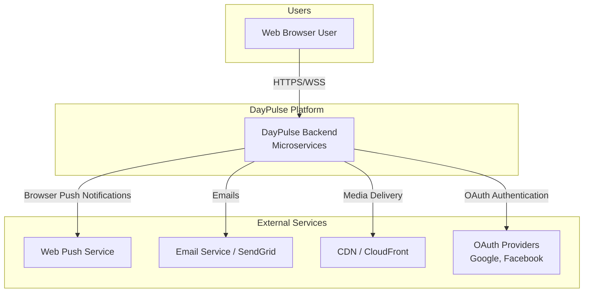
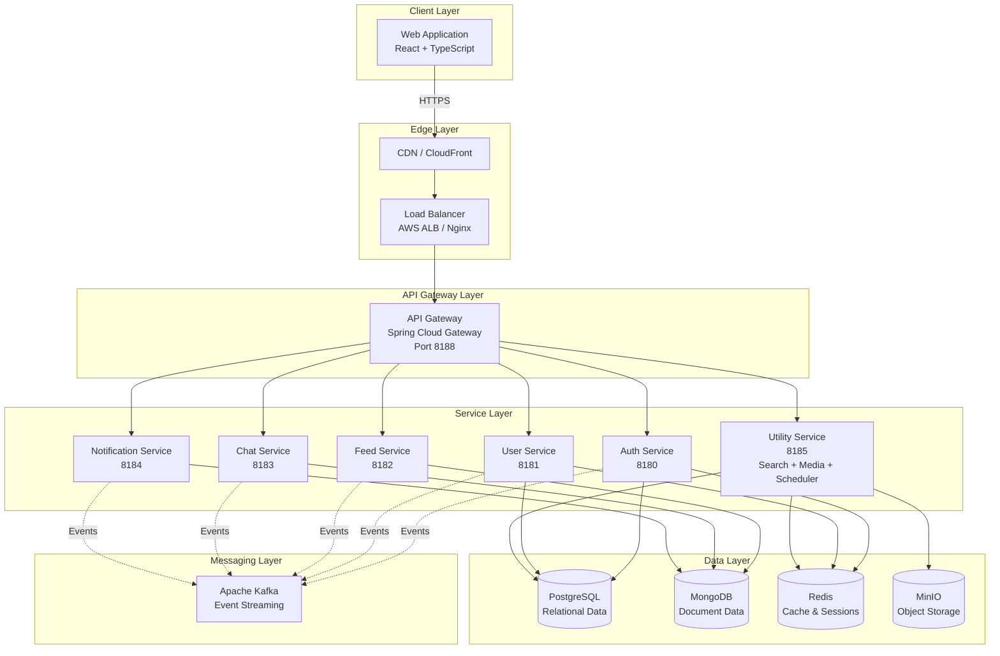
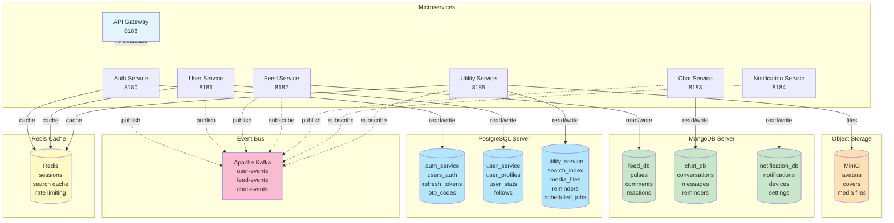
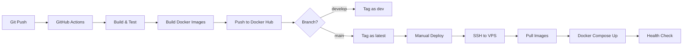

# DayPulse System Architecture

**Comprehensive Microservices Architecture Documentation**

---

## Table of Contents

1. [System Overview](#system-overview)
2. [System Context Diagram](#system-context-diagram)
3. [Container Architecture](#container-architecture)
4. [Service Catalog](#service-catalog)
5. [Technology Stack](#technology-stack)
6. [Data Architecture](#data-architecture)
7. [Security Architecture](#security-architecture)
8. [Communication Patterns](#communication-patterns)
9. [Cross-Cutting Concerns](#cross-cutting-concerns)
10. [Infrastructure Architecture](#infrastructure-architecture)
11. [API Design Standards](#api-design-standards)
12. [Deployment Strategy](#deployment-strategy)
13. [Scalability & Performance](#scalability--performance)
14. [Monitoring & Observability](#monitoring--observability)
15. [Development Workflow](#development-workflow)

---

## System Overview

**DayPulse** is a modern social platform built with a microservices architecture, designed to help users share daily moments, connect with friends, and maintain healthy social habits through streaks and reminders.

### Business Capabilities

- **User Management**: Registration, authentication, profile management, RBAC
- **Social Networking**: Follow/unfollow, user discovery, social graph
- **Content Sharing**: Create and share daily pulses (280-character posts)
- **Engagement**: Likes, comments, reactions
- **Real-time Communication**: Direct messaging, chat rooms
- **Notifications**: Push notifications, in-app alerts
- **Discovery**: User search, tag search, trending topics
- **Media Management**: Image/video uploads, CDN delivery
- **Scheduled Tasks**: Daily reminders, scheduled posts

### System Principles

1. **Microservices Architecture**: Independent, loosely-coupled services
2. **Domain-Driven Design**: Services organized around business domains
3. **API-First Design**: Well-defined contracts between services
4. **Event-Driven Communication**: Asynchronous messaging via Kafka
5. **Security by Design**: Defense in depth, zero-trust principles
6. **Cloud-Native**: Containerized, scalable, resilient
7. **Observability**: Comprehensive logging, metrics, and tracing

---

## System Context Diagram



### External Actors

**Users**:
- Web users (React app)

**External Services**:
- **Web Push Service**: Browser push notifications (via Push API)
- **SendGrid/AWS SES**: Transactional emails (verification, password reset)
- **CloudFront/CDN**: Media content delivery
- **OAuth Providers**: Google, Facebook, GitHub authentication

---

## Container Architecture

### High-Level Architecture



### Container Descriptions

| Layer | Component | Technology | Purpose |
|-------|-----------|------------|---------|
| **Client** | Web App | React, TypeScript, Vite | Primary web interface |
| **Edge** | CDN | CloudFront/CloudFlare | Static asset delivery, DDoS protection |
| | Load Balancer | AWS ALB/Nginx | Traffic distribution, SSL termination |
| **Gateway** | API Gateway | Spring Cloud Gateway | Routing, authentication, rate limiting |
| **Services** | 6 Microservices | Spring Boot | Business logic domains |
| **Data** | PostgreSQL | Relational DB | Structured data (users, auth, search) |
| | MongoDB | Document DB | Flexible data (feeds, chats, notifications) |
| | Redis | In-memory cache | Sessions, caching, rate limiting |
| | MinIO | Object storage | Media files (images, videos) - S3 compatible |
| **Messaging** | Kafka | Event streaming | Async communication, event sourcing |

---

## Service Catalog

### Overview

| Service | Port | Status | Database | Purpose |
|---------|------|--------|----------|---------|
| API Gateway | 8188 | ✅ **Implemented** | - | Request routing, JWT validation |
| Auth Service | 8180 | ✅ **Implemented** | PostgreSQL | Authentication, authorization, RBAC |
| User Service | 8181 | ✅ **Implemented** | PostgreSQL | User profiles, follow system, social graph |
| Feed Service | 8182 | 🔄 **Planned** | MongoDB | Posts/pulses, likes, comments, timeline |
| Chat Service | 8183 | 🔄 **Planned** | MongoDB | Real-time messaging, chat rooms |
| Notification Service | 8184 | 🔄 **Planned** | MongoDB | Push/in-app notifications, alerts |
| Utility Service | 8185 | 🔄 **Planned** | PostgreSQL + Redis + MinIO | Search, media uploads, scheduled tasks |

---

### API Gateway (Port 8188)

**Status**: ✅ Implemented

**Technology**: Spring Cloud Gateway (Reactive)

**Responsibilities**:
- Route requests to appropriate microservices
- JWT token validation (signature, expiration)
- Token introspection (revocation check)
- User identity extraction and forwarding
- CORS handling
- Rate limiting (future)
- Request/response logging

**Route Configuration**:

```
/api/v1/auth/**      → Auth Service (8180)
/api/v1/users/**     → User Service (8181)
/api/v1/feed/**      → Feed Service (8182)
/api/v1/chat/**      → Chat Service (8183)
/api/v1/notifications/** → Notification Service (8184)
/api/v1/search/**    → Utility Service (8185)
/api/v1/media/**     → Utility Service (8185)
/api/v1/scheduler/** → Utility Service (8185)
```

**Security Flow**:
1. Extract JWT from `Authorization: Bearer <token>` header
2. Validate JWT signature (HS512)
3. Check token expiration
4. Call Auth Service introspection endpoint
5. Extract `userId` and `scope` (roles) from JWT
6. Add internal headers: `X-User-Id`, `X-User-Roles`
7. Forward request to downstream service

**Key Components**:
- `GatewayJwtAuthenticationFilter.java` - JWT validation filter
- `SecurityConfig.java` - Security configuration
- `AuthServiceClient.java` - Auth service integration

**Configuration**:
```yaml
spring:
  cloud:
    gateway:
      routes:
        - id: auth-service
          uri: http://localhost:8180
          predicates:
            - Path=/api/v1/auth/**
          filters:
            - StripPrefix=2
```

---

### Auth Service (Port 8180)

**Status**: ✅ Implemented

**Technology**: Spring Boot + Spring Security + PostgreSQL

**Responsibilities**:
- User registration (email/password, OAuth)
- User authentication (login)
- JWT token generation (access + refresh tokens)
- Token refresh and revocation
- Password reset with OTP
- Email verification
- Role-Based Access Control (RBAC)

**Key Endpoints**:

| Endpoint | Method | Auth | Description |
|----------|--------|------|-------------|
| `/auth/signup` | POST | No | Register new user (OAuth 2.0 standard) |
| `/auth/login` | POST | No | Authenticate user, return tokens |
| `/auth/refresh` | POST | No | Refresh access token |
| `/auth/logout` | POST | Yes | Revoke all user tokens |
| `/auth/introspect` | POST | No | Validate token (gateway internal) |
| `/auth/forgot-password` | POST | No | Request password reset OTP |
| `/auth/verify-otp` | POST | No | Verify OTP code |
| `/auth/reset-password` | POST | No | Reset password with OTP |
| `/users/my-info` | GET | Yes | Get authenticated user info |

**Database Schema** (`auth-service` database):

| Table | Purpose | Key Columns |
|-------|---------|-------------|
| `users_auth` | User accounts and credentials | id, email, password_hash, role_enum, oauth_provider |
| `refresh_tokens` | JWT refresh tokens | id, user_id, token_hash, expires_at, revoked_at |
| `otp_codes` | One-time passwords for verification | id, user_id, code, type, expires_at, used_at |

**Note**: Full SQL schemas available in `auth-service/src/main/resources/db/migration/`

**JWT Token Structure**:
```json
{
  "header": {
    "alg": "HS512",
    "typ": "JWT"
  },
  "payload": {
    "sub": "user@example.com",
    "userId": "abc-123-...",
    "scope": "ROLE_USER",
    "iss": "daypulse-auth",
    "exp": 1698764800,
    "iat": 1698761200,
    "jti": "unique-id"
  }
}
```

**Token Expiration**:
- Access Token: 1 hour (3600 seconds)
- Refresh Token: 10 hours (36000 seconds)

**RBAC Roles**:
- `USER` - Standard user (default)
- `MODERATOR` - Content moderation
- `ADMIN` - Full system access

**Key Components**:
- `AuthenticationService.java` - Core auth logic
- `SecurityConfig.java` - Spring Security configuration
- `JwtAuthenticationEntryPoint.java` - Auth error handling
- `DataInitializer.java` - Default admin creation

---

### User Service (Port 8181)

**Status**: ✅ Implemented

**Technology**: Spring Boot + Spring Data JPA + PostgreSQL

**Responsibilities**:
- User profile management (CRUD)
- Profile setup (first-time completion)
- User statistics (followers, following, streak, posts)
- Follow/unfollow functionality
- User discovery (suggested users, search)
- Social graph management

**Key Endpoints**:

| Endpoint | Method | Auth | Description |
|----------|--------|------|-------------|
| `/users/me` | GET | Yes | Get authenticated user's profile |
| `/users/me` | PATCH | Yes | Update profile (partial updates) |
| `/users/me/setup` | POST | Yes | Complete profile setup (first time) |
| `/users/{id}` | GET | Yes | Get user profile by ID |
| `/users/{id}/followers` | GET | Yes | Get user's followers (paginated) |
| `/users/{id}/following` | GET | Yes | Get user's following (paginated) |
| `/users/{id}/follow` | POST | Yes | Follow a user |
| `/users/{id}/follow` | DELETE | Yes | Unfollow a user |
| `/users/suggested` | GET | Yes | Get suggested users to follow |
| `/users/available` | GET | Yes | Get all available users |

**Internal Endpoints** (service-to-service):

| Endpoint | Method | Purpose |
|----------|--------|---------|
| `/internal/users/{id}/init` | POST | Initialize profile after registration |
| `/internal/users/{id}/summary` | GET | Get user summary for denormalization |

**Database Schema** (`user-service` database):

| Table | Purpose | Key Columns |
|-------|---------|-------------|
| `user_profiles` | User profile information | id, username, name, bio, avatar_url, streak, timezone, language |
| `user_stats` | Aggregated user statistics | user_id, followers_count, following_count, pulses_count |
| `follows` | Follow relationships | follower_id, following_id, created_at |

**Note**: Full SQL schemas available in `user-service/src/main/resources/db/migration/`

**Key Components**:
- `UserProfileService.java` - Profile business logic
- `FollowService.java` - Follow/unfollow logic with stats updates
- `InternalUserController.java` - Service-to-service APIs

---

### Feed Service (Port 8182)

**Status**: 🔄 Planned

**Technology**: Spring Boot + MongoDB

**Responsibilities**:
- Create, read, update, delete pulses (posts)
- Like/unlike pulses
- Comment on pulses
- Reaction management (emoji reactions)
- User timeline generation
- Trending tags calculation
- Pulse visibility control (public/followers-only)

**Planned Endpoints**:

| Endpoint | Method | Auth | Description |
|----------|--------|------|-------------|
| `/feed` | GET | Yes | Get personalized feed (following + suggested) |
| `/feed/timeline/{userId}` | GET | Yes | Get user's timeline (their posts) |
| `/feed/pulses` | POST | Yes | Create new pulse |
| `/feed/pulses/{id}` | GET | Yes | Get pulse details |
| `/feed/pulses/{id}` | PATCH | Yes | Edit pulse (owner only) |
| `/feed/pulses/{id}` | DELETE | Yes | Delete pulse (owner only) |
| `/feed/pulses/{id}/like` | POST | Yes | Like pulse |
| `/feed/pulses/{id}/like` | DELETE | Yes | Unlike pulse |
| `/feed/pulses/{id}/comments` | GET | Yes | Get pulse comments |
| `/feed/pulses/{id}/comments` | POST | Yes | Add comment |
| `/feed/pulses/{id}/comments/{commentId}` | DELETE | Yes | Delete comment |
| `/feed/pulses/{id}/reactions` | GET | Yes | Get pulse reactions |
| `/feed/pulses/{id}/reactions` | POST | Yes | Add reaction |
| `/feed/trending/tags` | GET | Yes | Get trending tags |

**MongoDB Schema** (`feed_db` database):

| Collection | Purpose | Key Fields |
|------------|---------|------------|
| `pulses` | User posts/status updates | _id, userId, content, mood, tags, visibility, likesCount, commentsCount |
| `comments` | Comments on pulses | _id, pulseId, userId, content, createdAt |
| `reactions` | Emoji reactions to pulses | _id, pulseId, userId, emoji, createdAt |

**Document Structure**: Each document stores nested data and arrays for efficient reads

**Feed Generation Algorithm**:
1. Fetch posts from followed users (last 24-48 hours)
2. Mix in suggested posts from popular/trending users
3. Apply personalization based on user interactions
4. Sort by relevance score (time decay + engagement)
5. Paginate results (20 posts per page)

**Kafka Events**:
- `pulse.created` - New pulse published
- `pulse.liked` - Pulse liked
- `pulse.commented` - New comment added
- `pulse.deleted` - Pulse deleted

---

### Chat Service (Port 8183)

**Status**: 🔄 Planned

**Technology**: Spring Boot + MongoDB + WebSocket (STOMP)

**Responsibilities**:
- Real-time 1:1 messaging
- Chat room management
- Message delivery and read receipts
- Message reactions (emoji)
- Typing indicators
- Scheduled reminders within chats
- Unread message tracking

**Planned Endpoints**:

**REST APIs**:

| Endpoint | Method | Auth | Description |
|----------|--------|------|-------------|
| `/chat/conversations` | GET | Yes | Get user's chat list |
| `/chat/conversations/{id}` | GET | Yes | Get chat details |
| `/chat/conversations/{id}/messages` | GET | Yes | Get chat messages (paginated) |
| `/chat/conversations` | POST | Yes | Start new conversation |
| `/chat/messages` | POST | Yes | Send message |
| `/chat/messages/{id}/read` | POST | Yes | Mark message as read |
| `/chat/reminders` | GET | Yes | Get scheduled reminders |
| `/chat/reminders` | POST | Yes | Create reminder |
| `/chat/reminders/{id}` | DELETE | Yes | Delete reminder |

**WebSocket Endpoints**:

| Endpoint | Description |
|----------|-------------|
| `/ws/chat` | WebSocket connection endpoint |
| `/topic/chat/{chatId}` | Subscribe to chat messages |
| `/app/chat.send` | Send message |
| `/app/chat.typing` | Send typing indicator |

**MongoDB Schema** (`chat_db` database):

| Collection | Purpose | Key Fields |
|------------|---------|------------|
| `conversations` | Chat threads between users | _id, participants[], lastMessageId, lastMessageAt |
| `messages` | Individual chat messages | _id, conversationId, senderId, text, type, readBy[], createdAt |
| `reminders` | Scheduled chat reminders | _id, conversationId, time, type, target, content, enabled |

**Document Structure**: Optimized for real-time message retrieval and updates

**WebSocket Flow**:
1. Client connects to `/ws/chat` with JWT token
2. Server validates token and establishes connection
3. Client subscribes to `/topic/chat/{chatId}`
4. Messages sent to `/app/chat.send` are broadcast to subscribers
5. Typing indicators sent to `/app/chat.typing`

**Kafka Events**:
- `message.sent` - New message sent
- `message.read` - Message read by recipient
- `reminder.triggered` - Scheduled reminder fired

---

### Notification Service (Port 8184)

**Status**: 🔄 Planned

**Technology**: Spring Boot + MongoDB + Web Push API

**Responsibilities**:
- Browser push notification delivery (Web Push API)
- In-app notification management
- Notification preferences
- Notification templates
- Email notifications (via SendGrid/SES)
- Notification history and tracking

**Planned Endpoints**:

| Endpoint | Method | Auth | Description |
|----------|--------|------|-------------|
| `/notifications` | GET | Yes | Get user notifications (paginated) |
| `/notifications/unread-count` | GET | Yes | Get unread count |
| `/notifications/{id}/read` | POST | Yes | Mark notification as read |
| `/notifications/read-all` | POST | Yes | Mark all as read |
| `/notifications/settings` | GET | Yes | Get notification preferences |
| `/notifications/settings` | PATCH | Yes | Update preferences |
| `/notifications/devices` | POST | Yes | Register push subscription (Web Push) |
| `/notifications/devices/{token}` | DELETE | Yes | Unregister push subscription |

**MongoDB Schema** (`notification_db` database):

| Collection | Purpose | Key Fields |
|------------|---------|------------|
| `notifications` | User notification records | _id, userId, type, actorId, targetId, content, isRead, createdAt |
| `devices` | Push notification subscriptions | _id, userId, platform, subscription, userAgent, isActive |
| `notification_settings` | User notification preferences | _id, userId, likes{}, comments{}, follows{}, messages{} |

**Document Structure**: Flexible schema supports different notification types

**Notification Types**:
- `like` - Someone liked your pulse
- `comment` - Someone commented on your pulse
- `follow` - Someone followed you
- `mention` - Someone mentioned you in a pulse
- `message` - New chat message
- `reminder` - Scheduled reminder

**Web Push Integration**:
- Uses Web Push API with VAPID keys
- Service Worker for background notifications
- Browser permission management
- Fallback to in-app notifications if push disabled

**Kafka Event Listeners**:
- `pulse.liked` → Send like notification
- `pulse.commented` → Send comment notification
- `user.followed` → Send follow notification
- `message.sent` → Send message notification

---

### Utility Service (Port 8185)

**Status**: 🔄 Planned

**Technology**: Spring Boot + PostgreSQL + Redis + MinIO + Quartz Scheduler

**Responsibilities**:
This consolidated service handles three main areas:

**1. Search Capabilities**:
- Full-text user search
- Tag search
- Search suggestions and autocomplete
- Result ranking and relevance scoring

**2. Media Management**:
- File upload handling (images, videos)
- Image processing (resize, crop, optimize)
- Thumbnail generation
- Storage integration (MinIO - S3 compatible)

**3. Scheduler/Background Tasks**:
- Daily pulse reminders
- Recurring tasks (daily, weekly)
- Streak calculation and reset
- Cleanup jobs (expired tokens, old data)
- Report generation

**Planned Endpoints**:

**Search APIs**:

| Endpoint | Method | Auth | Description |
|----------|--------|------|-------------|
| `/search/users` | GET | Yes | Search users by name/username |
| `/search/tags` | GET | Yes | Search tags |
| `/search/pulses` | GET | Yes | Search pulses by content |
| `/search/suggestions` | GET | Yes | Get search suggestions (autocomplete) |
| `/search/trending/tags` | GET | Yes | Get trending tags |
| `/search/trending/users` | GET | Yes | Get trending users |

**Media APIs**:

| Endpoint | Method | Auth | Description |
|----------|--------|------|-------------|
| `/media/upload` | POST | Yes | Upload file (multipart/form-data) |
| `/media/images/{id}` | GET | No | Get image |
| `/media/videos/{id}` | GET | No | Get video |
| `/media/{id}` | DELETE | Yes | Delete media (owner only) |
| `/media/avatar` | POST | Yes | Upload avatar (auto-crop to square) |
| `/media/cover` | POST | Yes | Upload cover image |

**Scheduler APIs**:

| Endpoint | Method | Auth | Description |
|----------|--------|------|-------------|
| `/scheduler/reminders` | GET | Yes | Get user's reminders |
| `/scheduler/reminders` | POST | Yes | Create reminder |
| `/scheduler/reminders/{id}` | PATCH | Yes | Update reminder |
| `/scheduler/reminders/{id}` | DELETE | Yes | Delete reminder |
| `/scheduler/reminders/{id}/enable` | POST | Yes | Enable reminder |
| `/scheduler/reminders/{id}/disable` | POST | Yes | Disable reminder |

**PostgreSQL Schema** (`utility-service` database):

| Table | Purpose | Key Columns |
|-------|---------|-------------|
| `search_index` | Full-text search index | id, entity_type, entity_id, searchable_text, search_vector (tsvector) |
| `trending_tags` | Trending tag tracking | tag, score, pulse_count, updated_at |
| `media_files` | Uploaded media metadata | id, user_id, filename, storage_key, storage_url, status |
| `reminders` | User reminders | id, user_id, title, time, days_of_week, timezone, is_enabled |
| `scheduled_jobs` | Background job queue | id, job_type, schedule (cron), payload (jsonb), next_run_at |

**Indexes**: GIN index on `search_vector` for fast full-text search

**Note**: Full SQL schemas available in `utility-service/src/main/resources/db/migration/`

**Search Algorithm**:
1. Parse search query
2. Check Redis cache for recent searches
3. Full-text search on PostgreSQL using `tsvector`
4. Rank results by relevance score
5. Cache results in Redis (TTL: 5 minutes)
6. Return paginated results

**Media Processing**:
1. Client uploads file to `/media/upload`
2. Server validates file (type, size, dimensions)
3. Generate unique filename (UUID + extension)
4. Upload to MinIO bucket
5. Process image (resize to multiple sizes)
6. Generate URLs
7. Return media metadata

**Image Sizes**:
- Thumbnail: 150x150px (avatars)
- Small: 400x400px (feed previews)
- Medium: 800x800px (detail view)
- Large: 1200x1200px (full screen)

**MinIO Storage Structure**:
```
/avatars/{userId}/{filename}
/covers/{userId}/{filename}
/pulses/{pulseId}/{filename}
/chat/{chatId}/{filename}
```

**Scheduled Jobs**:
- **Daily Streak Update** (00:00 UTC): Calculate user streaks
- **Token Cleanup** (Daily): Remove expired refresh tokens
- **Notification Cleanup** (Weekly): Archive old notifications
- **Search Index Update** (Hourly): Update trending tags

**Redis Caching**:
- Search results: TTL 5 minutes
- Trending tags: TTL 15 minutes
- User suggestions: TTL 1 hour

**Kafka Events**:
- `pulse.created` → Index new pulse content
- `user.updated` → Update user search index
- `pulse.deleted` → Remove from search index
- `media.uploaded` → New media uploaded
- `media.processed` → Media processing complete
- `reminder.triggered` → Reminder fired
- `streak.updated` → User streak updated

**Key Components**:
- `SearchController.java` - Search endpoints
- `MediaController.java` - Media upload/retrieval endpoints
- `SchedulerController.java` - Reminder management endpoints
- `SearchService.java` - Full-text search logic
- `MediaService.java` - File processing and storage
- `SchedulerService.java` - Quartz job scheduling
- `MinIOConfig.java` - MinIO client configuration

---

### ~~Search Service (Port 8185)~~ - CONSOLIDATED INTO UTILITY SERVICE

**Status**: 🔄 Planned

**Technology**: Spring Boot + PostgreSQL (full-text search) + Redis (caching)

**Responsibilities**:
- Full-text user search
- Tag search
- Trending topics calculation
- Search suggestions and autocomplete
- Search history
- Result ranking and relevance scoring

**Planned Endpoints**:

| Endpoint | Method | Auth | Description |
|----------|--------|------|-------------|
| `/search/users` | GET | Yes | Search users by name/username |
| `/search/tags` | GET | Yes | Search tags |
| `/search/pulses` | GET | Yes | Search pulses by content |
| `/search/suggestions` | GET | Yes | Get search suggestions (autocomplete) |
| `/search/trending/tags` | GET | Yes | Get trending tags |
| `/search/trending/users` | GET | Yes | Get trending users |
| `/search/history` | GET | Yes | Get user's search history |

**PostgreSQL Schema**:

**search_index** table:
```sql
CREATE TABLE search_index (
    id UUID PRIMARY KEY DEFAULT gen_random_uuid(),
    entity_type VARCHAR(20), -- 'user', 'tag', 'pulse'
    entity_id VARCHAR(255),
    searchable_text TEXT,
    search_vector TSVECTOR,
    metadata JSONB,
    created_at TIMESTAMP DEFAULT CURRENT_TIMESTAMP
);

CREATE INDEX idx_search_vector ON search_index USING GIN(search_vector);
```

**trending_tags** table:
```sql
CREATE TABLE trending_tags (
    tag VARCHAR(100) PRIMARY KEY,
    score FLOAT,
    pulse_count INTEGER,
    updated_at TIMESTAMP DEFAULT CURRENT_TIMESTAMP
);
```

**Search Algorithm**:
1. Parse search query
2. Check Redis cache for recent searches
3. Full-text search on PostgreSQL using `ts_vector`
4. Rank results by relevance score
5. Apply personalization filters
6. Cache results in Redis (TTL: 5 minutes)
7. Return paginated results

**Redis Caching**:
- Search results: TTL 5 minutes
- Trending tags: TTL 15 minutes
- User suggestions: TTL 1 hour

**Kafka Event Listeners**:
- `pulse.created` → Index new pulse content
- `user.updated` → Update user search index
- `pulse.deleted` → Remove from search index

---

### ~~Media Service (Port 8186)~~ - CONSOLIDATED INTO UTILITY SERVICE

**Note**: Media management capabilities have been consolidated into the **Utility Service (Port 8185)** for simplified deployment and management.

See [Utility Service](#utility-service-port-8185) for details.

---

### ~~Scheduler Service (Port 8187)~~ - CONSOLIDATED INTO UTILITY SERVICE

**Note**: Scheduler and background task capabilities have been consolidated into the **Utility Service (Port 8185)** for simplified deployment and management.

See [Utility Service](#utility-service-port-8185) for details.

---

## Technology Stack

### Backend Technologies

| Category | Technology | Version | Purpose |
|----------|------------|---------|---------|
| **Language** | Java | 17 LTS | Primary backend language |
| **Framework** | Spring Boot | 3.2+ | Application framework |
| | Spring Cloud Gateway | 4.0+ | API Gateway (reactive) |
| | Spring Security | 6.0+ | Authentication & authorization |
| | Spring Data JPA | 3.2+ | ORM for PostgreSQL |
| | Spring Data MongoDB | 4.0+ | MongoDB integration |
| | Spring WebFlux | 6.0+ | Reactive programming |
| | Spring WebSocket | 6.0+ | WebSocket support (Chat) |
| **Build Tool** | Maven | 3.9+ | Dependency management, builds |
| **Databases** | PostgreSQL | 15+ | Relational data (auth, users) |
| | MongoDB | 6.0+ | Document data (feeds, chats) |
| | Redis | 7.0+ | Caching, sessions |
| **Message Queue** | Apache Kafka | 3.5+ | Event streaming |
| **Storage** | MinIO | Latest | Object storage (media files) - S3 compatible, self-hosted |
| **Search** | PostgreSQL FTS | - | Full-text search |
| **Scheduler** | Quartz | 2.3+ | Job scheduling |
| **Validation** | Hibernate Validator | 8.0+ | Bean validation |
| **Logging** | SLF4J + Logback | 2.0+ | Structured logging |
| **Metrics** | Micrometer + Prometheus | 1.11+ | Application metrics |
| **Tracing** | Spring Cloud Sleuth | 3.1+ | Distributed tracing |
| **Documentation** | Springdoc OpenAPI | 2.2+ | API documentation |
| **Testing** | JUnit 5 | 5.10+ | Unit testing |
| | Mockito | 5.5+ | Mocking framework |
| | Testcontainers | 1.19+ | Integration testing |

### Frontend Technologies

| Category | Technology | Version | Purpose |
|----------|------------|---------|---------|
| **Language** | TypeScript | 5.0+ | Type-safe JavaScript |
| **Framework** | React | 18+ | UI framework |
| **Build Tool** | Vite | 5.0+ | Fast bundler and dev server |
| **State Management** | Zustand | 4.4+ | Lightweight state management |
| **Data Fetching** | React Query | 5.0+ | Server state management |
| **Routing** | React Router | 6.20+ | Client-side routing |
| **Styling** | TailwindCSS | 3.3+ | Utility-first CSS |
| **HTTP Client** | Axios | 1.6+ | HTTP requests |
| **WebSocket** | SockJS + STOMP | 1.6+ | Real-time communication |
| **Internationalization** | Custom i18n | - | Multi-language support |
| **Testing** | Vitest | 1.0+ | Unit testing |
| | React Testing Library | 14+ | Component testing |

### Infrastructure Technologies

| Category | Technology | Purpose |
|----------|------------|---------|
| **Containerization** | Docker | 24+ | Container runtime |
| **Orchestration** | Docker Compose | 2.0+ | Local multi-container orchestration |
| **CI/CD** | GitHub Actions | - | Automated builds and tests |
| **Container Registry** | Docker Hub | - | Container image storage |
| **Reverse Proxy** | Nginx / Traefik | - | Traffic routing, SSL termination |
| **CDN** | CloudFlare (free tier) | - | Static asset delivery, DDoS protection |
| **Monitoring** | Prometheus + Grafana | - | Metrics and dashboards |
| **Logging** | Loki + Promtail | - | Lightweight log aggregation |
| **Tracing** | Jaeger (optional) | - | Distributed tracing |
| **Secret Management** | Docker Secrets / .env files | - | Environment-based configuration |

---

## Data Architecture

### Database Design Principles

1. **Database per Service**: Each microservice owns its database (polyglot persistence)
2. **No Direct Database Access**: Services communicate via APIs only
3. **Event-Driven Synchronization**: Use Kafka for data consistency across services
4. **Denormalization**: Duplicate data where needed for performance
5. **Schema Versioning**: Use Flyway/Liquibase for migrations

### Database Architecture Diagram



### Database Overview by Technology

| Technology | Databases | Total Tables/Collections | Services |
|------------|-----------|-------------------------|----------|
| **PostgreSQL** | 3 databases | ~15 tables | Auth, User, Utility |
| **MongoDB** | 3 databases | ~9 collections | Feed, Chat, Notification |
| **Redis** | 1 instance | Multiple key patterns | Auth, User, Utility |
| **MinIO** | 1 instance | 4 buckets | Utility |
| **Kafka** | 1 cluster | 4 topics | All services |

### Data Storage Strategy

| Service | Database | Rationale |
|---------|----------|-----------|
| **Auth Service** | PostgreSQL | Structured data, ACID transactions for auth |
| **User Service** | PostgreSQL | Relational data (follows, profiles) |
| **Feed Service** | MongoDB | Flexible schema, high write throughput |
| **Chat Service** | MongoDB | Document model fits chat messages well |
| **Notification Service** | MongoDB | Flexible notification types |
| **Utility Service** | PostgreSQL + Redis + MinIO | Search index, job scheduling, media storage |

### Data Consistency Patterns

#### 1. Strong Consistency (Synchronous)
Used within service boundaries (single database)
- User profile updates
- Follow/unfollow operations

#### 2. Eventual Consistency (Asynchronous)
Used across service boundaries (via Kafka)
- User statistics updates (follower count)
- Search index updates
- Notification delivery

#### 3. Saga Pattern
For distributed transactions:
- User registration flow: Auth Service → User Service → Notification Service

**Example: User Registration Saga**
```
1. Auth Service: Create user account
   ↓ (success)
2. Publish event: user.registered
   ↓
3. User Service: Initialize user profile
   ↓ (success)
4. Publish event: user.profile.initialized
   ↓
5. Notification Service: Send welcome email
```

If step 3 fails, Auth Service receives compensation event and can:
- Mark account as incomplete
- Delete account
- Retry initialization

### Caching Strategy

**Redis Cache Layers**:

1. **Session Cache** (TTL: 1 hour)
   - JWT token blacklist
   - Active user sessions

2. **Data Cache** (TTL: 5-15 minutes)
   - User profile data
   - User statistics
   - Search results

3. **Application Cache** (TTL: 1 hour)
   - Trending tags
   - Suggested users
   - Popular content

**Cache Invalidation**:
- Write-through: Update DB and cache simultaneously
- Cache-aside: Invalidate cache on write, lazy reload on read
- TTL-based: Automatic expiration

---

## Security Architecture

### Security Principles

1. **Defense in Depth**: Multiple security layers
2. **Zero Trust**: Verify every request
3. **Least Privilege**: Minimal permissions
4. **Secure by Default**: Security built-in, not added
5. **Audit Everything**: Comprehensive logging

### Authentication & Authorization

#### JWT-Based Authentication

**Token Flow**:
```
┌─────────┐           ┌─────────┐           ┌──────────┐
│ Client  │           │ Gateway │           │ Auth Svc │
└────┬────┘           └────┬────┘           └────┬─────┘
     │                     │                     │
     │ 1. Login            │                     │
     ├────────────────────────────────────────────>
     │                     │                     │
     │ 2. Validate         │                     │
     │    credentials      │                     │
     │                     │                     │
     │ 3. Return JWT       │                     │
     <────────────────────────────────────────────┤
     │                     │                     │
     │ 4. API Request      │                     │
     │    + JWT            │                     │
     ├────────────────────>│                     │
     │                     │                     │
     │                     │ 5. Validate JWT     │
     │                     ├────────────────────>│
     │                     │                     │
     │                     │ 6. Token valid      │
     │                     <────────────────────┤
     │                     │                     │
     │                     │ 7. Forward request  │
     │                     │    + X-User-Id      │
     │                     ├─────────────────────> [Service]
```

**Security Features**:
- HMAC-SHA512 signature
- Token expiration (1 hour access, 10 hours refresh)
- Token rotation on refresh
- Revocation support via blacklist
- JWT ID (jti) for tracking

#### Role-Based Access Control (RBAC)

**Roles**:
- `USER` - Standard user
- `MODERATOR` - Content moderation
- `ADMIN` - System administration

**Permissions** (Enum-based):
```java
public enum PermissionEnum {
    // User permissions
    USER_READ,
    USER_UPDATE,
    USER_DELETE,
    
    // Content permissions
    CONTENT_CREATE,
    CONTENT_READ,
    CONTENT_UPDATE,
    CONTENT_DELETE,
    CONTENT_MODERATE,
    
    // Admin permissions
    SYSTEM_ADMIN,
    USER_MANAGE,
    ROLE_MANAGE
}
```

**Authorization Matrix**:

| Permission | USER | MODERATOR | ADMIN |
|-----------|------|-----------|-------|
| Create content | ✅ | ✅ | ✅ |
| Edit own content | ✅ | ✅ | ✅ |
| Delete own content | ✅ | ✅ | ✅ |
| Moderate content | ❌ | ✅ | ✅ |
| Delete any content | ❌ | ✅ | ✅ |
| Manage users | ❌ | ❌ | ✅ |
| Manage roles | ❌ | ❌ | ✅ |

### Security Layers

#### Layer 1: Network Security
- HTTPS/TLS 1.3 (production)
- Private VPC for services
- Security groups: Only API Gateway exposed
- DDoS protection (CloudFlare/AWS Shield)
- Rate limiting at CDN layer

#### Layer 2: API Gateway Security
- JWT signature validation
- Token expiration checks
- Token introspection (revocation)
- CORS policy enforcement
- Rate limiting per user/IP
- Request size limits
- SQL injection pattern detection

#### Layer 3: Service Security
- Input validation (Bean Validation)
- Output encoding
- SQL injection prevention (prepared statements)
- XSS prevention
- CSRF protection (stateless, JWT-based)
- Secure password hashing (BCrypt, cost 10)

#### Layer 4: Data Security
- Encrypted connections (SSL/TLS)
- Database access control (IAM)
- Secret management (AWS Secrets Manager)
- Encryption at rest (future)
- PII data masking in logs
- Secure backups

### API Security Best Practices

1. **Always use HTTPS** in production
2. **Validate all inputs** at API gateway and service layers
3. **Sanitize outputs** to prevent XSS
4. **Use parameterized queries** to prevent SQL injection
5. **Implement rate limiting** to prevent abuse
6. **Log security events** for audit trails
7. **Keep dependencies updated** to patch vulnerabilities
8. **Use security headers**: HSTS, CSP, X-Frame-Options

### Security Headers (Production)

```yaml
Strict-Transport-Security: max-age=31536000; includeSubDomains
X-Content-Type-Options: nosniff
X-Frame-Options: DENY
X-XSS-Protection: 1; mode=block
Content-Security-Policy: default-src 'self'
Referrer-Policy: strict-origin-when-cross-origin
```

---

## Communication Patterns

### Synchronous Communication (REST APIs)

**Use Cases**:
- Read operations (GET)
- Immediate response required
- User-initiated actions

**Pattern**: HTTP/REST
```
Client → API Gateway → Service → Database → Response
```

**Best Practices**:
- Use HTTP methods correctly (GET, POST, PUT, PATCH, DELETE)
- Implement proper error handling (4xx, 5xx)
- Include correlation IDs for tracing
- Set reasonable timeouts
- Implement circuit breakers

### Asynchronous Communication (Event-Driven)

**Use Cases**:
- Background processing
- Service decoupling
- Fan-out (one event, multiple consumers)
- Audit logging

**Pattern**: Kafka Event Streaming
```
Service A → Kafka Topic → Service B, C, D (consumers)
```

**Event Design**:

```json
{
  "eventId": "uuid",
  "eventType": "user.registered",
  "eventVersion": "1.0",
  "timestamp": "ISO8601",
  "correlationId": "request-id",
  "payload": {
    "userId": "uuid",
    "email": "user@example.com"
  }
}
```

**Kafka Topics**:

| Topic | Producers | Consumers | Purpose |
|-------|-----------|-----------|---------|
| `user-events` | Auth, User | Search, Notification | User lifecycle events |
| `feed-events` | Feed | Notification, Search, User | Content events |
| `chat-events` | Chat | Notification | Message events |
| `notification-events` | All services | Notification | Notification triggers |

### Service-to-Service Communication

**Internal APIs** (not exposed via gateway):
- Prefix: `/internal/...`
- No JWT required (trust boundary)
- Used for service orchestration
- Should be documented but not public

**Example**: User Service internal API
```
POST /internal/users/{id}/init - Initialize profile after registration
GET /internal/users/{id}/summary - Get user summary for denormalization
```

**Security**: Internal endpoints should only be accessible within VPC

### WebSocket Communication (Real-Time)

**Use Cases**:
- Chat messages
- Live notifications
- Typing indicators
- Online status updates

**Pattern**: WebSocket + STOMP over SockJS
```
Client ←→ API Gateway ←→ Chat Service
         (WebSocket)        (WebSocket)
```

**Connection Flow**:
1. Client connects to `/ws` endpoint with JWT
2. Server validates JWT
3. Client subscribes to topics: `/topic/chat/{chatId}`
4. Bidirectional message flow
5. Heartbeat for connection health

---

## Cross-Cutting Concerns

### Logging

**Logging Strategy**:
- Structured logging (JSON format)
- Correlation IDs for request tracing
- Log levels: ERROR, WARN, INFO, DEBUG
- Centralized log aggregation (ELK Stack)

**Log Format**:
```json
{
  "timestamp": "2026-01-23T10:30:45.123Z",
  "level": "INFO",
  "service": "user-service",
  "traceId": "abc-123-def",
  "spanId": "span-456",
  "userId": "user-789",
  "message": "User profile updated",
  "context": {
    "method": "PATCH",
    "endpoint": "/users/me",
    "duration": 45
  }
}
```

**What to Log**:
- All API requests (with duration)
- Authentication events
- Authorization failures
- Database queries (slow queries)
- External service calls
- Errors and exceptions
- Business events

**What NOT to Log**:
- Passwords (plain or hashed)
- JWT tokens (full token)
- PII data (mask if necessary)
- Credit card numbers
- API keys/secrets

### Error Handling

**Standard Error Response**:
```json
{
  "success": false,
  "errorCode": "USER_NOT_FOUND",
  "message": "User with ID abc-123 not found",
  "timestamp": "2026-01-23T10:30:45.123Z",
  "path": "/api/v1/users/abc-123",
  "traceId": "def-456"
}
```

**HTTP Status Codes**:
- `200 OK` - Success
- `201 Created` - Resource created
- `204 No Content` - Success, no response body
- `400 Bad Request` - Validation error
- `401 Unauthorized` - Authentication required
- `403 Forbidden` - Insufficient permissions
- `404 Not Found` - Resource not found
- `409 Conflict` - Resource conflict
- `429 Too Many Requests` - Rate limit exceeded
- `500 Internal Server Error` - Server error
- `503 Service Unavailable` - Service down

### Distributed Tracing

**OpenTelemetry Integration**:
- Trace ID: Unique per request
- Span ID: Unique per service call
- Parent Span ID: Links spans in a trace

**Trace Visualization**:
```
User Request → API Gateway → Auth Service → Database
                  ↓              (50ms)
              User Service → Database
                (120ms)
                  
Total Duration: 170ms
```

### Resilience Patterns

#### Circuit Breaker
Prevents cascading failures when a service is down

**States**:
- **Closed**: Normal operation
- **Open**: Service unavailable, fail fast
- **Half-Open**: Testing if service recovered

**Configuration**:
```yaml
resilience4j:
  circuitbreaker:
    instances:
      userService:
        failure-rate-threshold: 50
        wait-duration-in-open-state: 10s
        sliding-window-size: 10
```

#### Retry Policy
Automatically retry failed requests

**Strategy**: Exponential backoff
```
Attempt 1: Immediate
Attempt 2: 1s delay
Attempt 3: 2s delay
Attempt 4: 4s delay
Max attempts: 4
```

#### Timeout Policy
Prevent indefinite waiting

**Configuration**:
```yaml
# Service-to-service calls
timeout:
  read: 5000ms    # 5 seconds
  connect: 2000ms # 2 seconds
```

#### Bulkhead Pattern
Isolate thread pools to prevent resource exhaustion

```yaml
resilience4j:
  bulkhead:
    instances:
      default:
        max-concurrent-calls: 25
        max-wait-duration: 100ms
```

---

## Infrastructure Architecture

### Local Development Environment

```
Developer Machine (Docker Compose)
├── Infrastructure Layer
│   ├── PostgreSQL (5432) - Relational database
│   ├── MongoDB (27017) - Document database
│   ├── Redis (6379) - Cache
│   ├── MinIO (9000) - Object storage
│   └── Kafka (9092) - Event streaming
│
├── Application Services
│   ├── API Gateway (8188)
│   ├── Auth Service (8180)
│   ├── User Service (8181)
│   ├── Feed Service (8182)
│   ├── Chat Service (8183)
│   ├── Notification Service (8184)
│   └── Utility Service (8185)
│
└── Frontend
    └── React Dev Server (5173)
```

**Docker Compose Configuration** (`docker-compose.yml`):
```yaml
version: '3.8'

services:
  # Infrastructure
  postgres:
    image: postgres:15-alpine
    environment:
      POSTGRES_USER: daypulse
      POSTGRES_PASSWORD: dev_password
      POSTGRES_MULTIPLE_DATABASES: auth_service,user_service,utility_service
    ports: ["5432:5432"]
    volumes:
      - postgres_data:/var/lib/postgresql/data
    networks: [daypulse-net]

  mongodb:
    image: mongo:6
    environment:
      MONGO_INITDB_ROOT_USERNAME: daypulse
      MONGO_INITDB_ROOT_PASSWORD: dev_password
    ports: ["27017:27017"]
    volumes:
      - mongo_data:/data/db
    networks: [daypulse-net]

  redis:
    image: redis:7-alpine
    ports: ["6379:6379"]
    volumes:
      - redis_data:/data
    networks: [daypulse-net]

  minio:
    image: minio/minio:latest
    command: server /data --console-address ":9001"
    environment:
      MINIO_ROOT_USER: daypulse
      MINIO_ROOT_PASSWORD: dev_password
    ports:
      - "9000:9000"  # API
      - "9001:9001"  # Console
    volumes:
      - minio_data:/data
    networks: [daypulse-net]

  kafka:
    image: apache/kafka:latest
    environment:
      KAFKA_NODE_ID: 1
      KAFKA_PROCESS_ROLES: broker,controller
      KAFKA_LISTENERS: PLAINTEXT://0.0.0.0:9092,CONTROLLER://0.0.0.0:9093
      KAFKA_ADVERTISED_LISTENERS: PLAINTEXT://kafka:9092
      KAFKA_CONTROLLER_LISTENER_NAMES: CONTROLLER
      KAFKA_LISTENER_SECURITY_PROTOCOL_MAP: CONTROLLER:PLAINTEXT,PLAINTEXT:PLAINTEXT
      KAFKA_CONTROLLER_QUORUM_VOTERS: 1@localhost:9093
    ports: ["9092:9092"]
    volumes:
      - kafka_data:/var/lib/kafka/data
    networks: [daypulse-net]

  # Application Services
  api-gateway:
    build: ./backEnd/api-gateway
    ports: ["8188:8188"]
    environment:
      SPRING_PROFILES_ACTIVE: dev
    depends_on: [auth-service, user-service]
    networks: [daypulse-net]

  auth-service:
    build: ./backEnd/auth-service
    ports: ["8180:8180"]
    environment:
      SPRING_PROFILES_ACTIVE: dev
      DB_HOST: postgres
      REDIS_HOST: redis
    depends_on: [postgres, redis]
    networks: [daypulse-net]

  user-service:
    build: ./backEnd/user-service
    ports: ["8181:8181"]
    environment:
      SPRING_PROFILES_ACTIVE: dev
      DB_HOST: postgres
      REDIS_HOST: redis
    depends_on: [postgres, redis]
    networks: [daypulse-net]

  feed-service:
    build: ./backEnd/feed-service
    ports: ["8182:8182"]
    environment:
      SPRING_PROFILES_ACTIVE: dev
      MONGODB_HOST: mongodb
    depends_on: [mongodb, kafka]
    networks: [daypulse-net]

  chat-service:
    build: ./backEnd/chat-service
    ports: ["8183:8183"]
    environment:
      SPRING_PROFILES_ACTIVE: dev
      MONGODB_HOST: mongodb
    depends_on: [mongodb, kafka]
    networks: [daypulse-net]

  notification-service:
    build: ./backEnd/notification-service
    ports: ["8184:8184"]
    environment:
      SPRING_PROFILES_ACTIVE: dev
      MONGODB_HOST: mongodb
    depends_on: [mongodb, kafka]
    networks: [daypulse-net]

  utility-service:
    build: ./backEnd/utility-service
    ports: ["8185:8185"]
    environment:
      SPRING_PROFILES_ACTIVE: dev
      DB_HOST: postgres
      REDIS_HOST: redis
      MINIO_ENDPOINT: http://minio:9000
    depends_on: [postgres, redis, minio, kafka]
    networks: [daypulse-net]

networks:
  daypulse-net:
    driver: bridge

volumes:
  postgres_data:
  mongo_data:
  redis_data:
  minio_data:
  kafka_data:
```

**Quick Start Commands**:
```bash
# Start all services
docker-compose up -d

# View logs
docker-compose logs -f [service-name]

# Stop all services
docker-compose down

# Rebuild a service
docker-compose up -d --build [service-name]

# Access MinIO Console
http://localhost:9001 (user: daypulse, password: dev_password)
```

### Self-Hosted Production Environment

**Deployment Options**:

#### Option 1: Single VPS (Small Scale)
```
VPS Server (e.g., DigitalOcean Droplet, Hetzner, Contabo)
├── Nginx (Reverse Proxy + SSL)
├── Docker Compose
│   ├── All 6 microservices
│   ├── PostgreSQL
│   ├── MongoDB
│   ├── Redis
│   ├── MinIO
│   └── Kafka
├── CloudFlare (CDN + DDoS protection)
└── Monitoring Stack
    ├── Prometheus
    ├── Grafana
    └── Loki
```

**Recommended Specs**:
- **CPU**: 4-8 vCPUs
- **RAM**: 16-32 GB
- **Storage**: 100-200 GB SSD
- **Bandwidth**: 5-10 TB/month
- **Cost**: $40-80/month

**Setup Steps**:
1. Provision VPS (Ubuntu 22.04 LTS)
2. Install Docker & Docker Compose
3. Configure Nginx with SSL (Let's Encrypt)
4. Clone repository and configure `.env` files
5. Run `docker-compose -f docker-compose.prod.yml up -d`
6. Configure CloudFlare for CDN and DNS
7. Set up automated backups

#### Option 2: Multi-Server Setup (Medium Scale)
```
Application Server (4 vCPU, 8GB RAM)
├── Nginx
└── Docker Compose (6 microservices)

Database Server (4 vCPU, 16GB RAM, SSD)
├── PostgreSQL (with replication)
├── MongoDB
└── Redis

Storage Server (2 vCPU, 4GB RAM, HDD)
└── MinIO
```

**Production Docker Compose** (`docker-compose.prod.yml`):
```yaml
version: '3.8'

services:
  # Reverse Proxy
  nginx:
    image: nginx:alpine
    ports:
      - "80:80"
      - "443:443"
    volumes:
      - ./nginx/conf.d:/etc/nginx/conf.d
      - ./nginx/ssl:/etc/nginx/ssl
      - ./nginx/logs:/var/log/nginx
    depends_on: [api-gateway]
    networks: [daypulse-net]
    restart: unless-stopped

  # Application Services (same as dev but with prod profile)
  api-gateway:
    image: daypulse/api-gateway:latest
    environment:
      SPRING_PROFILES_ACTIVE: prod
    networks: [daypulse-net]
    restart: unless-stopped

  auth-service:
    image: daypulse/auth-service:latest
    environment:
      SPRING_PROFILES_ACTIVE: prod
      DB_HOST: ${POSTGRES_HOST}
      DB_PASSWORD: ${POSTGRES_PASSWORD}
      REDIS_HOST: ${REDIS_HOST}
      JWT_SECRET: ${JWT_SECRET}
    networks: [daypulse-net]
    restart: unless-stopped

  # ... (similar for other services)

  # Monitoring
  prometheus:
    image: prom/prometheus:latest
    volumes:
      - ./prometheus/config:/etc/prometheus
      - prometheus_data:/prometheus
    ports: ["9090:9090"]
    networks: [daypulse-net]
    restart: unless-stopped

  grafana:
    image: grafana/grafana:latest
    environment:
      GF_SECURITY_ADMIN_PASSWORD: ${GRAFANA_PASSWORD}
    volumes:
      - grafana_data:/var/lib/grafana
    ports: ["3000:3000"]
    networks: [daypulse-net]
    restart: unless-stopped

networks:
  daypulse-net:
    driver: bridge

volumes:
  prometheus_data:
  grafana_data:
```

**Backup Strategy**:
```bash
# Automated daily backup script
#!/bin/bash
DATE=$(date +%Y%m%d)

# Backup PostgreSQL
docker exec postgres pg_dumpall -U daypulse > backup_$DATE.sql

# Backup MongoDB
docker exec mongodb mongodump --out=/backup/mongo_$DATE

# Backup MinIO (object storage)
mc mirror minio/daypulse-media /backup/minio_$DATE

# Upload to remote backup storage
rsync -avz /backup/ user@backup-server:/backups/daypulse/
```

**Future Cloud Migration Path** (when ready for DevOps learning):
1. **Start Simple**: Master Docker Compose on VPS
2. **Add Monitoring**: Prometheus, Grafana, logs
3. **Learn Scaling**: Database replication, load balancing
4. **Cloud Native**: Migrate to Kubernetes (K3s → GKE/EKS)
5. **Advanced**: Service mesh, auto-scaling, multi-region

---

## API Design Standards

### RESTful Principles

1. **Resource-Based URLs**: Use nouns, not verbs
   - ✅ `GET /users/{id}`
   - ❌ `GET /getUser?id={id}`

2. **HTTP Methods**: Use standard HTTP verbs
   - `GET` - Retrieve resource(s)
   - `POST` - Create resource
   - `PUT` - Replace resource (full update)
   - `PATCH` - Update resource (partial update)
   - `DELETE` - Delete resource

3. **Hierarchical Resources**: Use path hierarchy
   - `GET /users/{userId}/pulses` - Get user's pulses
   - `GET /pulses/{pulseId}/comments` - Get pulse comments

4. **Query Parameters**: Use for filtering, sorting, pagination
   - `GET /users?role=admin&page=2&size=20`
   - `GET /pulses?tag=motivation&sort=createdAt&order=desc`

### API Versioning

**Strategy**: URL-based versioning
```
/api/v1/users
/api/v2/users
```

**Version Lifecycle**:
- v1: Stable, widely used
- v2: New features, breaking changes
- v1 deprecation: 6-month notice
- v1 sunset: Remove after 1 year

### Pagination

**Standard Pagination** (offset-based):
```
GET /users?page=0&size=20

Response:
{
  "content": [...],
  "page": 0,
  "size": 20,
  "totalElements": 150,
  "totalPages": 8,
  "first": true,
  "last": false
}
```

**Cursor-Based Pagination** (for feeds):
```
GET /feed?cursor=abc123&limit=20

Response:
{
  "data": [...],
  "nextCursor": "def456",
  "hasMore": true
}
```

### Response Formats

**Success Response** (with data):
```json
{
  "success": true,
  "data": {
    "id": "abc-123",
    "name": "John Doe"
  },
  "timestamp": "2026-01-23T10:30:45.123Z"
}
```

**Success Response** (no data):
```json
{
  "success": true,
  "message": "User deleted successfully",
  "timestamp": "2026-01-23T10:30:45.123Z"
}
```

**Error Response**:
```json
{
  "success": false,
  "errorCode": "VALIDATION_ERROR",
  "message": "Invalid input data",
  "errors": [
    {
      "field": "email",
      "message": "Email is required"
    }
  ],
  "timestamp": "2026-01-23T10:30:45.123Z",
  "path": "/api/v1/users",
  "traceId": "xyz-789"
}
```

### Request/Response Headers

**Standard Request Headers**:
```
Content-Type: application/json
Accept: application/json
Authorization: Bearer <jwt-token>
X-Request-ID: <uuid> (for tracing)
Accept-Language: en-US
```

**Standard Response Headers**:
```
Content-Type: application/json
X-Request-ID: <uuid> (echoed back)
X-Response-Time: <milliseconds>
X-RateLimit-Limit: 100
X-RateLimit-Remaining: 95
X-RateLimit-Reset: <timestamp>
```

### Rate Limiting

**Strategy**: Token bucket algorithm

**Limits** (per user):
- Authentication endpoints: 5 requests/minute
- Read endpoints: 100 requests/minute
- Write endpoints: 20 requests/minute
- File uploads: 10 requests/hour

**Rate Limit Headers**:
```
X-RateLimit-Limit: 100
X-RateLimit-Remaining: 75
X-RateLimit-Reset: 1706010045
```

**Rate Limit Exceeded Response** (HTTP 429):
```json
{
  "success": false,
  "errorCode": "RATE_LIMIT_EXCEEDED",
  "message": "Too many requests. Please try again later.",
  "retryAfter": 60
}
```

---

## Deployment Strategy

### CI/CD Pipeline (Simplified for Self-Hosted)



**Pipeline Stages**:

1. **Build**: Compile Java code, run unit tests (Maven)
2. **Test**: Integration tests with Testcontainers
3. **Docker**: Build container images with multi-stage builds
4. **Push**: Push to Docker Hub (public or private registry)
5. **Deploy**: Manual or scripted deployment to VPS
6. **Verify**: Health checks via API calls

### Deployment Process

#### Development Deployment (Local)
```bash
# Build all services
mvn clean package -DskipTests

# Start all containers
docker-compose up -d

# View logs
docker-compose logs -f

# Restart a specific service
docker-compose restart user-service
```

#### Production Deployment (VPS)

**Option 1: Manual Deployment**
```bash
# On your VPS
cd /opt/daypulse

# Pull latest images
docker-compose -f docker-compose.prod.yml pull

# Restart services (recreate containers)
docker-compose -f docker-compose.prod.yml up -d

# Check status
docker-compose -f docker-compose.prod.yml ps

# View logs
docker-compose -f docker-compose.prod.yml logs -f
```

**Option 2: Automated Deployment Script**
```bash
#!/bin/bash
# deploy.sh

set -e

echo "🚀 Starting deployment..."

# Pull latest code
git pull origin main

# Pull latest Docker images
docker-compose -f docker-compose.prod.yml pull

# Backup database before deployment
./scripts/backup.sh

# Stop and remove old containers
docker-compose -f docker-compose.prod.yml down

# Start new containers
docker-compose -f docker-compose.prod.yml up -d

# Wait for services to be healthy
sleep 30

# Health check
curl -f http://localhost:8188/actuator/health || exit 1

echo "✅ Deployment successful!"
```

### Rollback Strategy

**Quick Rollback** (if deployment fails):
```bash
# View available image tags
docker images daypulse/user-service

# Edit docker-compose.prod.yml to use previous tag
# Change: image: daypulse/user-service:latest
# To:     image: daypulse/user-service:v1.2.3

# Restart with previous version
docker-compose -f docker-compose.prod.yml up -d user-service

# Restore database from backup if needed
./scripts/restore.sh backup_20260123.sql
```

### Environment Configuration

**Configuration Hierarchy**:
```
application.yml (base config)
    ↓
application-dev.yml (development overrides)
application-staging.yml (staging overrides)
application-prod.yml (production overrides)
```

**Environment Variables**:
```bash
# Application
SPRING_PROFILES_ACTIVE=prod
SERVER_PORT=8181

# Database
DB_HOST=prod-postgres.example.com
DB_PORT=5432
DB_NAME=user_service
DB_USERNAME=${DB_USERNAME} # from Secrets Manager
DB_PASSWORD=${DB_PASSWORD} # from Secrets Manager

# Redis
REDIS_HOST=prod-redis.example.com
REDIS_PORT=6379

# Kafka
KAFKA_BOOTSTRAP_SERVERS=kafka-1:9092,kafka-2:9092

# JWT
JWT_SECRET_KEY=${JWT_SECRET_KEY} # from Secrets Manager
JWT_EXPIRATION=3600

# External Services
AWS_REGION=us-east-1
S3_BUCKET=daypulse-media-prod
```

### Database Migrations

**Flyway Migration Example**:
```sql
-- V1__initial_schema.sql
CREATE TABLE users_auth (
    id UUID PRIMARY KEY DEFAULT gen_random_uuid(),
    email VARCHAR(255) UNIQUE NOT NULL,
    password_hash VARCHAR(255) NOT NULL,
    created_at TIMESTAMP DEFAULT CURRENT_TIMESTAMP
);

-- V2__add_role_column.sql
ALTER TABLE users_auth ADD COLUMN role_enum VARCHAR(20) DEFAULT 'USER';
```

**Migration Strategy**:
1. Backward-compatible changes first (add columns)
2. Deploy new application version
3. Run data migrations
4. Remove deprecated columns (next release)

---

## Scalability & Performance

### Horizontal Scaling

**Stateless Services** (easy to scale):
- API Gateway: Scale based on request throughput
- Auth Service: Scale based on authentication load
- User Service: Scale based on API calls
- Feed Service: Scale based on feed generation load

**Stateful Services** (requires careful scaling):
- Chat Service: WebSocket connection affinity
- Scheduler Service: Leader election for cron jobs

**Auto-Scaling Configuration** (Kubernetes HPA):
```yaml
apiVersion: autoscaling/v2
kind: HorizontalPodAutoscaler
metadata:
  name: user-service-hpa
spec:
  scaleTargetRef:
    apiVersion: apps/v1
    kind: Deployment
    name: user-service
  minReplicas: 3
  maxReplicas: 20
  metrics:
  - type: Resource
    resource:
      name: cpu
      target:
        type: Utilization
        averageUtilization: 70
  - type: Resource
    resource:
      name: memory
      target:
        type: Utilization
        averageUtilization: 80
```

### Database Scaling

**Read Replicas**:
- Master: Write operations
- Replicas: Read operations
- Replication lag: < 100ms

**Connection Pooling**:
```yaml
spring:
  datasource:
    hikari:
      maximum-pool-size: 20
      minimum-idle: 5
      connection-timeout: 30000
      idle-timeout: 600000
      max-lifetime: 1800000
```

**Database Sharding** (future):
- Shard key: User ID
- Consistent hashing for user data
- Cross-shard queries minimized

### Caching Strategy

**Cache Layers**:
1. **CDN Cache**: Static assets (images, CSS, JS)
2. **Application Cache (Redis)**: API responses, session data
3. **Database Query Cache**: Frequently accessed data

**Cache TTL Strategy**:
- User profiles: 5 minutes
- User stats: 1 minute
- Search results: 5 minutes
- Trending tags: 15 minutes

**Cache Eviction**:
- Write-through: Update cache on write
- Invalidation: Clear cache on data change
- TTL expiration: Automatic cleanup

### Performance Targets

| Metric | Target | Critical |
|--------|--------|----------|
| API Response Time (p95) | < 200ms | < 500ms |
| API Response Time (p99) | < 500ms | < 1000ms |
| Database Query Time | < 50ms | < 100ms |
| Cache Hit Rate | > 80% | > 60% |
| WebSocket Latency | < 100ms | < 200ms |
| Page Load Time (FCP) | < 1.5s | < 3s |
| Time to Interactive (TTI) | < 3s | < 5s |

---

## Monitoring & Observability

### Metrics Collection

**Application Metrics** (Micrometer + Prometheus):
- Request rate (requests/second)
- Response time (latency distribution)
- Error rate (errors/total requests)
- Active connections
- Thread pool utilization
- JVM metrics (heap, GC)

**Business Metrics**:
- User registrations (per day)
- Active users (DAU, MAU)
- Pulses created (per hour)
- Messages sent (per minute)
- Notifications delivered

**Infrastructure Metrics**:
- CPU usage
- Memory usage
- Disk I/O
- Network throughput
- Container health

### Logging Strategy

**Log Aggregation** (ELK Stack):
```
Application Logs → Filebeat → Logstash → Elasticsearch → Kibana
```

**Log Levels**:
- **ERROR**: Critical errors requiring immediate attention
- **WARN**: Warning conditions (deprecated API usage)
- **INFO**: Significant events (user login, API calls)
- **DEBUG**: Detailed debugging information

**Log Retention**:
- Development: 7 days
- Staging: 30 days
- Production: 90 days (ERROR/WARN: 1 year)

### Distributed Tracing

**Jaeger Integration**:
- Trace every request across services
- Visualize request flow
- Identify performance bottlenecks
- Analyze error propagation

**Trace Example**:
```
Request ID: xyz-789
Total Duration: 245ms

Gateway [50ms]
  ↓
Auth Service [30ms]
  → Database Query [15ms]
  ↓
User Service [120ms]
  → Database Query [80ms]
  → Redis Cache [10ms]
  ↓
Response [45ms]
```

### Alerting

**Alert Rules** (Prometheus Alertmanager):

1. **High Error Rate**
   - Condition: Error rate > 5% for 5 minutes
   - Severity: Critical
   - Action: Page on-call engineer

2. **High Latency**
   - Condition: p95 latency > 500ms for 10 minutes
   - Severity: Warning
   - Action: Slack notification

3. **Service Down**
   - Condition: Health check fails for 2 minutes
   - Severity: Critical
   - Action: Page on-call engineer

4. **Database Connection Pool Exhausted**
   - Condition: Active connections > 90% for 5 minutes
   - Severity: Critical
   - Action: Auto-scale + alert

5. **Disk Space Low**
   - Condition: Disk usage > 85%
   - Severity: Warning
   - Action: Slack notification

### Health Checks

**Liveness Probe** (Is service alive?):
```
GET /actuator/health/liveness
Response: {"status": "UP"}
```

**Readiness Probe** (Is service ready to receive traffic?):
```
GET /actuator/health/readiness
Response: {
  "status": "UP",
  "components": {
    "db": {"status": "UP"},
    "redis": {"status": "UP"}
  }
}
```

### Dashboards

**Grafana Dashboards**:
1. **System Overview**: All services health, request rate, error rate
2. **Service Details**: Per-service metrics, logs, traces
3. **Database Performance**: Query performance, connection pool
4. **Business Metrics**: User activity, content creation
5. **Infrastructure**: CPU, memory, disk, network

---

## Development Workflow

### Local Development Setup

**Prerequisites**:
- Java 17 JDK
- Maven 3.9+
- Docker & Docker Compose
- Node.js 18+ & npm
- Git

**Backend Setup**:
```bash
# Clone repository
git clone https://github.com/daypulse/backend.git
cd backend

# Start infrastructure (PostgreSQL, Redis)
docker-compose up -d postgres redis

# Run Auth Service
cd auth-service
mvn spring-boot:run

# Run User Service (in another terminal)
cd user-service
mvn spring-boot:run

# Run API Gateway (in another terminal)
cd api-gateway
mvn spring-boot:run
```

**Frontend Setup**:
```bash
# Clone repository
git clone https://github.com/daypulse/frontend.git
cd frontend

# Install dependencies
npm install

# Start dev server
npm run dev
```

### Code Structure

**Backend Service Structure**:
```
user-service/
├── src/
│   ├── main/
│   │   ├── java/com/daypulse/user_service/
│   │   │   ├── controller/          # REST endpoints
│   │   │   ├── service/             # Business logic
│   │   │   ├── repository/          # Data access
│   │   │   ├── entity/              # JPA entities
│   │   │   ├── dto/                 # DTOs (request/response)
│   │   │   ├── mapper/              # Entity ↔ DTO mappers
│   │   │   ├── config/              # Spring configuration
│   │   │   ├── exception/           # Exception handlers
│   │   │   └── UserServiceApplication.java
│   │   └── resources/
│   │       ├── application.yml      # Configuration
│   │       └── db/migration/        # Flyway migrations
│   └── test/
│       └── java/                    # Unit & integration tests
├── pom.xml                          # Maven dependencies
└── Dockerfile
```

**Frontend Structure**:
```
frontEnd/
├── src/
│   ├── features/                    # Feature modules
│   │   ├── auth/
│   │   │   ├── pages/              # Login, Register, etc.
│   │   │   └── hooks/              # useAuth, etc.
│   │   ├── feed/
│   │   │   ├── pages/              # Feed page
│   │   │   ├── components/         # StatusCard, etc.
│   │   │   └── hooks/              # useFeed, etc.
│   │   └── ...
│   ├── components/                  # Shared components
│   │   ├── layout/                 # Layout, Header, etc.
│   │   ├── ui/                     # Button, Avatar, etc.
│   │   └── modals/                 # Modals
│   ├── services/                    # API services
│   │   └── api/
│   │       └── client.ts           # Axios client
│   ├── store/                       # Zustand stores
│   │   ├── authStore.ts
│   │   └── uiStore.ts
│   ├── types/                       # TypeScript types
│   ├── app/                         # App setup
│   │   ├── App.tsx
│   │   ├── routes.tsx
│   │   └── providers.tsx
│   └── index.tsx                    # Entry point
├── package.json
├── tsconfig.json
├── vite.config.ts
└── Dockerfile
```

### Testing Strategy

**Backend Testing**:

1. **Unit Tests** (JUnit 5 + Mockito):
```java
@Test
void shouldCreateUserProfile() {
    // Arrange
    UserProfile user = new UserProfile();
    when(userRepository.save(any())).thenReturn(user);
    
    // Act
    UserProfile result = userService.createProfile(user);
    
    // Assert
    assertNotNull(result);
    verify(userRepository).save(user);
}
```

2. **Integration Tests** (SpringBootTest + Testcontainers):
```java
@SpringBootTest
@Testcontainers
class UserServiceIntegrationTest {
    @Container
    static PostgreSQLContainer<?> postgres = 
        new PostgreSQLContainer<>("postgres:15");
    
    @Test
    void shouldSaveAndRetrieveUser() {
        // Test with real database
    }
}
```

3. **API Tests** (MockMvc):
```java
@Test
void shouldReturnUserProfile() throws Exception {
    mockMvc.perform(get("/users/me")
        .header("X-User-Id", userId))
        .andExpect(status().isOk())
        .andExpect(jsonPath("$.data.id").value(userId));
}
```

**Frontend Testing**:

1. **Unit Tests** (Vitest):
```typescript
test('should render user name', () => {
  const user = { id: '1', name: 'John Doe' };
  render(<UserCard user={user} />);
  expect(screen.getByText('John Doe')).toBeInTheDocument();
});
```

2. **Component Tests** (React Testing Library):
```typescript
test('should submit login form', async () => {
  const onSubmit = vi.fn();
  render(<LoginForm onSubmit={onSubmit} />);
  
  await userEvent.type(screen.getByLabelText('Email'), 'test@example.com');
  await userEvent.type(screen.getByLabelText('Password'), 'password123');
  await userEvent.click(screen.getByRole('button', { name: 'Login' }));
  
  expect(onSubmit).toHaveBeenCalledWith({
    email: 'test@example.com',
    password: 'password123'
  });
});
```

### Git Workflow

**Branch Strategy**:
```
main (production)
  ↓
develop (staging)
  ↓
feature/user-profile
feature/chat-system
bugfix/login-issue
hotfix/security-patch
```

**Commit Convention** (Conventional Commits):
```
feat: add user profile update endpoint
fix: resolve JWT validation bug
docs: update API documentation
refactor: extract user service logic
test: add integration tests for follow system
chore: update dependencies
```

**Pull Request Process**:
1. Create feature branch from `develop`
2. Implement feature with tests
3. Push to remote and create PR
4. Code review (at least 1 approval)
5. CI/CD pipeline passes
6. Merge to `develop`
7. Deploy to staging
8. Merge to `main` for production

---

## Summary

### Current Implementation Status

✅ **Implemented**:
- API Gateway with JWT validation
- Auth Service with RBAC
- User Service with follow system
- Frontend with React + TypeScript
- Docker Compose development environment

🔄 **Planned (Simplified to 6 Services)**:
- Feed Service (posts/pulses)
- Chat Service (real-time messaging)
- Notification Service (web push)
- Utility Service (search + media + scheduler)
- Kafka event streaming
- Self-hosted deployment

### Architecture Highlights

1. **Simplified Microservices**: 6 services instead of 9 for easier management
2. **API Gateway**: Single entry point, centralized security
3. **Event-Driven**: Async communication via Kafka
4. **Polyglot Persistence**: PostgreSQL + MongoDB + Redis + MinIO
5. **Self-Hosted Focus**: Docker Compose for local and production deployment
6. **Security First**: JWT, RBAC, defense in depth
7. **Cost-Effective**: No expensive cloud services, VPS-based hosting
8. **Learning-Oriented**: Master basics before scaling to complex infrastructure

### Consolidated Services

**Utility Service** combines three previously separate services:
- **Search**: Full-text search, trending tags, user discovery
- **Media**: File uploads, image processing, MinIO storage
- **Scheduler**: Reminders, background jobs, streak calculation

This consolidation provides:
- ✅ Fewer services to manage (6 vs 9)
- ✅ Simpler deployment and monitoring
- ✅ Lower resource requirements
- ✅ Easier development and debugging
- ✅ Single database for related utilities

### Next Steps

**Phase 1: Complete Core Services** (Current Focus)
1. Implement Feed Service (posts/pulses, likes, comments)
2. Implement Chat Service (real-time messaging with WebSocket)
3. Implement Notification Service (web push notifications)
4. Implement Utility Service (search + media + scheduler)

**Phase 2: Event-Driven Architecture**
5. Set up Kafka for event streaming
6. Implement event handlers across services
7. Add event sourcing for audit logs

**Phase 3: Production Deployment**
8. Deploy to self-hosted VPS with Docker Compose
9. Configure Nginx reverse proxy with SSL
10. Set up automated backups
11. Configure CloudFlare for CDN and DDoS protection

**Phase 4: Monitoring & Observability**
12. Add Prometheus + Grafana for metrics
13. Configure Loki for log aggregation
14. Set up health checks and alerts
15. Create monitoring dashboards

**Phase 5: Frontend Enhancements**
16. Enhance web app with Progressive Web App (PWA) features
17. Implement service worker for offline support
18. Add web push notification support
19. Optimize performance (lazy loading, code splitting)

**Phase 6: DevOps Learning** (Future)
20. Learn Kubernetes basics (start with K3s locally)
21. Implement CI/CD automation
22. Explore cloud migration options (when needed)
23. Advanced topics: Service mesh, auto-scaling

### Why This Approach?

**Learning Path**:
1. **Start Simple**: Master Docker Compose and microservices basics
2. **Build Confidence**: Deploy real application to production (VPS)
3. **Learn Incrementally**: Add complexity as you understand each layer
4. **Stay Practical**: Focus on working software over complex infrastructure

**Benefits**:
- 💰 **Cost-Effective**: $40-80/month VPS vs $200+ cloud costs
- 🎓 **Educational**: Learn fundamentals before advanced topics
- 🚀 **Fast Deployment**: Docker Compose deploys in minutes
- 🔧 **Easy Debugging**: All logs accessible via `docker-compose logs`
- 📊 **Resource Efficient**: Runs well on modest hardware
- 🔄 **Easy Rollback**: Simple `docker-compose down/up` workflow

**When to Consider Kubernetes**:
- User base grows beyond single VPS capacity (10,000+ concurrent users)
- Need automatic scaling and self-healing
- Multiple regions/data centers required
- Team size grows (DevOps engineer joins)
- Ready to invest time in infrastructure complexity

---

**Document Version**: 1.0.0  
**Last Updated**: 2026-01-23  
**Status**: Living document - updated as system evolves  
**Maintainers**: DayPulse Architecture Team

---

## Appendix

### Related Documentation

- [Backend Architecture](back/ARCHITECTURE.md) - Detailed backend implementation
- [Frontend Architecture](front/ARCHITECTURE.md) - Frontend structure and patterns
- [API Reference](back/API_REFERENCE.md) - Complete API documentation
- [Development Guide](back/DEVELOPMENT_GUIDE.md) - Setup and development workflow

### External Resources

- [Spring Boot Documentation](https://spring.io/projects/spring-boot)
- [React Documentation](https://react.dev)
- [Kubernetes Documentation](https://kubernetes.io/docs)
- [Microservices Patterns](https://microservices.io/patterns)
- [The Twelve-Factor App](https://12factor.net)

### Architecture Decision Records (ADRs)

**ADR-001: Microservices Architecture**
- Decision: Adopt microservices over monolith
- Rationale: Scalability, team independence, technology flexibility
- Status: Accepted

**ADR-002: API Gateway Pattern**
- Decision: Use Spring Cloud Gateway as API gateway
- Rationale: Centralized security, routing, monitoring
- Status: Accepted

**ADR-003: JWT Authentication**
- Decision: Use JWT for stateless authentication
- Rationale: Scalable, no server-side session storage
- Status: Accepted

**ADR-004: Event-Driven with Kafka**
- Decision: Use Apache Kafka for async communication
- Rationale: Decoupling, event sourcing, scalability
- Status: Accepted

**ADR-005: Polyglot Persistence**
- Decision: Use different databases per service (PostgreSQL, MongoDB)
- Rationale: Right tool for the job, service autonomy
- Status: Accepted

---

*End of Document*
