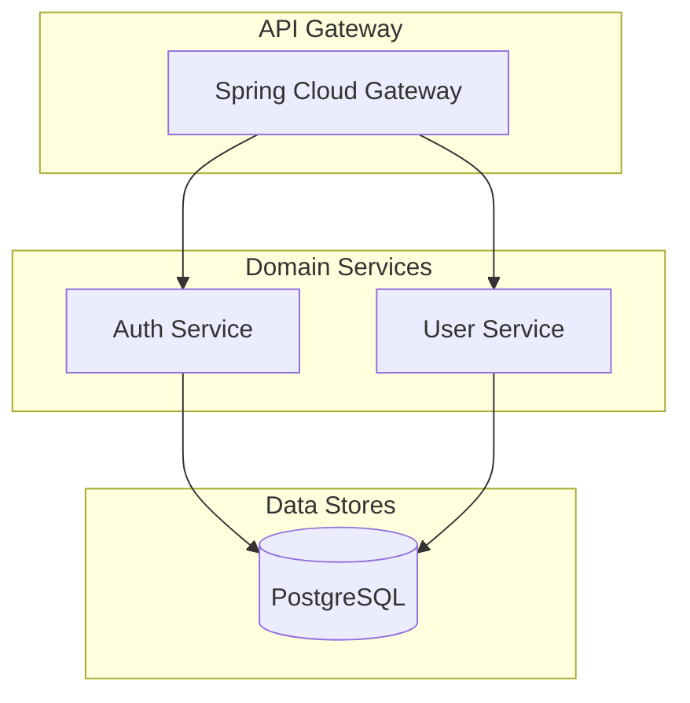

# DayPulse Backend Architecture

Complete architecture documentation for the DayPulse microservices backend.

---

## Table of Contents

- [Current Implementation](#current-implementation)
- [Architecture Diagrams](#architecture-diagrams)
- [Security Model](#security-model)
- [Database Schema](#database-schema)
- [Planned Features](#planned-features-future)

---

## Current Implementation

### Services Overview

DayPulse currently implements a microservices architecture with three core services:



| Service | Port | Responsibility | Technology | Database |
|---------|------|---------------|------------|----------|
| **API Gateway** | 8188 | Routing, JWT validation, user identity forwarding | Spring Cloud Gateway (Reactive) | - |
| **Auth Service** | 8180 | Authentication, token management, user accounts, RBAC | Spring Boot + Spring Security | PostgreSQL |
| **User Service** | 8181 | User profiles, follow/unfollow, social graph | Spring Boot + JPA | PostgreSQL |

### API Gateway (Port 8188)

**Responsibilities**:
- Request routing to microservices
- JWT token validation (signature, expiration, revocation)
- User identity extraction and forwarding via internal headers
- CORS handling
- Public vs protected endpoint differentiation

**Routes**:
- `/api/v1/auth/**` → Auth Service (Port 8180)
- `/api/v1/users/**` → User Service (Port 8181)

**Key Components**:
- `configuration/SecurityConfig.java` - Security rules configuration
- `security/GatewayJwtAuthenticationFilter.java` - JWT validation logic
- `client/AuthServiceClient.java` - Auth service integration

**Security Flow**:
1. Extract JWT from `Authorization: Bearer <token>` header
2. Validate JWT signature using shared secret key (HS512)
3. Check token expiration
4. Call Auth Service introspection endpoint to verify token not revoked
5. Extract `userId` and `scope` (roles) from JWT claims
6. Add internal headers: `X-User-Id`, `X-User-Roles`
7. Forward request to downstream service

### Auth Service (Port 8180)

**Responsibilities**:
- User registration and authentication
- JWT token generation (access + refresh tokens)
- Token validation and revocation
- User credential management
- Role-Based Access Control (RBAC)

**Key Endpoints**:

| Endpoint | Method | Auth | Description |
|----------|--------|------|-------------|
| `/auth/signup` | POST | No | Create new account (OAuth 2.0 standard) |
| `/auth/register` | POST | No | Register user (deprecated, use signup) |
| `/auth/login` | POST | No | Authenticate and receive tokens |
| `/auth/refresh` | POST | No | Renew access token using refresh token |
| `/auth/logout` | POST | Yes | Revoke all user tokens |
| `/auth/introspect` | POST | No | Validate token (for gateway) |
| `/users/my-info` | GET | Yes | Get authenticated user info |

**Token Standards**:

**Access Token (JWT)**:
- Algorithm: HS512 (HMAC with SHA-512)
- Expiration: 1 hour (3600 seconds)
- Claims: `sub` (email), `userId`, `scope` (roles), `iss`, `exp`, `iat`, `jti`
- Transport: `Authorization: Bearer <token>` header

**Refresh Token**:
- Algorithm: HS512
- Expiration: 10 hours (36000 seconds)
- Storage: Hashed (MD5) in database
- Rotation: New token generated on each use, old token revoked
- Transport: Request body

**RBAC Implementation**:
- **Roles**: USER (default), MODERATOR, ADMIN
- **Permissions**: Enum-based (compile-time safety)
- **Storage**: Single `role_enum` column per user
- **Admin Auto-Creation**: Default admin user created on startup

### User Service (Port 8181)

**Responsibilities**:
- User profile management (CRUD)
- User statistics tracking (followers, following, pulses count)
- Follow/unfollow functionality
- User discovery (suggested users, available users)

**Key Endpoints**:

| Endpoint | Method | Auth | Description |
|----------|--------|------|-------------|
| `/users/me` | GET | Yes | Get authenticated user's profile |
| `/users/me` | PATCH | Yes | Update profile (partial updates) |
| `/users/me/setup` | POST | Yes | Complete profile setup (first time) |
| `/users/{id}` | GET | Yes | Get user profile by ID |
| `/users/{id}/followers` | GET | Yes | Get user's followers (paginated) |
| `/users/{id}/following` | GET | Yes | Get user's following (paginated) |
| `/users/{id}/follow` | POST | Yes | Follow a user |
| `/users/{id}/follow` | DELETE | Yes | Unfollow a user |
| `/users/suggested` | GET | Yes | Get suggested users |
| `/users/available` | GET | Yes | Get all available users |

**Internal Endpoints** (not exposed via gateway):

| Endpoint | Method | Purpose |
|----------|--------|---------|
| `/internal/users/{id}/summary` | GET | Get user summary for denormalization |
| `/internal/users/{id}/init` | POST | Initialize profile after registration |

**Key Components**:
- `controller/UserController.java` - Public user endpoints
- `controller/InternalUserController.java` - Internal service-to-service APIs
- `service/UserProfileService.java` - Profile business logic
- `service/FollowService.java` - Follow/unfollow logic with stats updates

---

## Architecture Diagrams

### System Overview

```
┌──────────────────────────────────────────────────────────────────────┐
│                          CLIENT APPLICATIONS                          │
│                                                                        │
│  ┌──────────────┐  ┌──────────────┐  ┌──────────────┐               │
│  │ Web Browser  │  │  Mobile App  │  │ Desktop App  │               │
│  │  (React/    │  │   (iOS/      │  │  (Electron)  │               │
│  │   Vue/...)   │  │   Android)   │  │              │               │
│  └──────────────┘  └──────────────┘  └──────────────┘               │
│           │                 │                │                        │
│           └─────────────────┴────────────────┘                        │
│                             │                                         │
│              HTTP/HTTPS with Bearer Token Authentication             │
│                             │                                         │
└─────────────────────────────┼─────────────────────────────────────────┘
                              │
                              ▼
┌──────────────────────────────────────────────────────────────────────┐
│                         PUBLIC INTERNET                               │
│                      (HTTPS in production)                            │
└─────────────────────────────┬─────────────────────────────────────────┘
                              │
                              ▼
┌──────────────────────────────────────────────────────────────────────┐
│                      DMZ / PUBLIC SUBNET                              │
│  ┌────────────────────────────────────────────────────────────────┐ │
│  │                     API GATEWAY (Port 8188)                     │ │
│  │  ┌──────────────────────────────────────────────────────────┐  │ │
│  │  │ Spring Cloud Gateway (Reactive)                          │  │ │
│  │  │                                                            │  │ │
│  │  │ ┌─────────────────────────────────────────────────────┐  │  │ │
│  │  │ │ JWT Authentication Filter                           │  │  │ │
│  │  │ │ • Extract Authorization: Bearer <token>             │  │  │ │
│  │  │ │ • Validate JWT signature (HS512)                    │  │  │ │
│  │  │ │ • Check expiration (exp claim)                      │  │  │ │
│  │  │ │ • Call Auth Service introspection                   │  │  │ │
│  │  │ │ • Extract userId, roles from JWT                    │  │  │ │
│  │  │ │ • Add internal headers: X-User-Id, X-User-Roles     │  │  │ │
│  │  │ └─────────────────────────────────────────────────────┘  │  │ │
│  │  │                                                            │  │ │
│  │  │ ┌─────────────────────────────────────────────────────┐  │  │ │
│  │  │ │ Route Configuration                                 │  │  │ │
│  │  │ │ • /api/v1/auth/** → Auth Service                    │  │  │ │
│  │  │ │ • /api/v1/users/** → User Service                   │  │  │ │
│  │  │ │ • CORS configuration                                 │  │  │ │
│  │  │ │ • Security policies (public vs protected)           │  │  │ │
│  │  │ └─────────────────────────────────────────────────────┘  │  │ │
│  │  └──────────────────────────────────────────────────────────┘  │ │
│  └────────────────────────────────────────────────────────────────┘ │
└──────────────┬────────────────────────┬──────────────────────────────┘
               │                        │
               │   Internal Network     │
               │   (Private Subnet)     │
               ▼                        ▼
┌──────────────────────────────┐ ┌──────────────────────────────┐
│   AUTH SERVICE (Port 8180)   │ │   USER SERVICE (Port 8181)   │
│  ┌────────────────────────┐  │ │  ┌────────────────────────┐  │
│  │ Spring Boot + Security │  │ │  │ Spring Boot + JPA      │  │
│  │                        │  │ │  │                        │  │
│  │ Endpoints:             │  │ │  │ Endpoints:             │  │
│  │ • POST /auth/signup    │  │ │  │ • GET /users/me        │  │
│  │ • POST /auth/login     │  │ │  │ • PATCH /users/me      │  │
│  │ • POST /auth/refresh   │  │ │  │ • GET /users/{id}      │  │
│  │ • POST /auth/logout    │  │ │  │ • Follow/Unfollow APIs │  │
│  │ • POST /auth/introspect│  │ │  │                        │  │
│  │                        │  │ │  │ Internal Endpoints:    │  │
│  │ Functions:             │  │ │  │ • POST /internal/users/│  │
│  │ • User registration    │  │ │  │   {id}/init            │  │
│  │ • Password validation  │  │ │  │ • GET /internal/users/ │  │
│  │ • JWT generation       │  │ │  │   {id}/summary         │  │
│  │ • Token revocation     │  │ │  │                        │  │
│  │ • Role management      │  │ │  └────────────────────────┘  │
│  └─────────┬──────────────┘  │ └─────────┬──────────────────┘
│            │                 │           │                    │
│            ▼                 │           ▼                    │
│  ┌─────────────────────┐    │ ┌─────────────────────┐        │
│  │ PostgreSQL Database │    │ │ PostgreSQL Database │        │
│  │ auth-service        │    │ │ user-service        │        │
│  │                     │    │ │                     │        │
│  │ Tables:             │    │ │ Tables:             │        │
│  │ • users_auth        │    │ │ • user_profiles     │        │
│  │ • refresh_tokens    │    │ │ • user_stats        │        │
│  │ • otp_codes         │    │ │ • follows           │        │
│  └─────────────────────┘    │ └─────────────────────┘        │
└──────────────────────────────┘ └──────────────────────────────┘
```

### Authentication Flows

#### 1. User Signup Flow

```
┌────────┐                  ┌──────────┐                ┌──────────┐
│ Client │                  │ Gateway  │                │   Auth   │
│        │                  │          │                │ Service  │
└────┬───┘                  └────┬─────┘                └────┬─────┘
     │                           │                           │
     │ 1. POST /api/v1/auth/signup                          │
     ├──────────────────────────>│                           │
     │ Headers:                  │                           │
     │   Content-Type: json      │                           │
     │ Body:                     │                           │
     │   {email, password}       │                           │
     │                           │                           │
     │                           │ 2. Route to auth service  │
     │                           ├──────────────────────────>│
     │                           │ POST /auth-service/       │
     │                           │      auth/signup          │
     │                           │                           │
     │                           │                           │ 3. Process signup
     │                           │                           │    • Validate email format
     │                           │                           │    • Check if email exists
     │                           │                           │    • Hash password (BCrypt)
     │                           │                           │    • Save user to DB
     │                           │                           │    • Assign ROLE_USER
     │                           │                           │
     │                           │ 4. Response               │
     │                           │<──────────────────────────┤
     │                           │ 201 Created               │
     │                           │ {success, userId, email}  │
     │                           │                           │
     │ 5. Forward response       │                           │
     │<──────────────────────────┤                           │
     │ 201 Created               │                           │
     │ {success, userId, email}  │                           │
```

#### 2. User Login Flow

```
┌────────┐                  ┌──────────┐                ┌──────────┐
│ Client │                  │ Gateway  │                │   Auth   │
│        │                  │          │                │ Service  │
└────┬───┘                  └────┬─────┘                └────┬─────┘
     │                           │                           │
     │ 1. POST /api/v1/auth/login                           │
     ├──────────────────────────>│                           │
     │ Body:                     │                           │
     │   {email, password}       │                           │
     │                           │                           │
     │                           │ 2. Route request          │
     │                           ├──────────────────────────>│
     │                           │                           │
     │                           │                           │ 3. Authenticate
     │                           │                           │    • Find user by email
     │                           │                           │    • Verify password hash
     │                           │                           │    • Generate access token
     │                           │                           │      - Algorithm: HS512
     │                           │                           │      - Expiry: 1 hour
     │                           │                           │      - Claims: userId, scope
     │                           │                           │    • Generate refresh token
     │                           │                           │      - Expiry: 10 hours
     │                           │                           │    • Save refresh token hash
     │                           │                           │
     │                           │ 4. Return tokens          │
     │                           │<──────────────────────────┤
     │                           │ 200 OK                    │
     │                           │ {user, tokens: {          │
     │                           │   accessToken,            │
     │                           │   refreshToken,           │
     │                           │   expiresIn: 3600,        │
     │                           │   tokenType: "Bearer"     │
     │                           │ }}                        │
     │                           │                           │
     │ 5. Forward response       │                           │
     │<──────────────────────────┤                           │
     │ 200 OK + tokens           │                           │
     │                           │                           │
     │ 6. Store tokens securely  │                           │
     │    (memory/storage)       │                           │
```

#### 3. Accessing Protected Resources

```
┌────────┐        ┌──────────┐        ┌──────────┐        ┌──────────┐
│ Client │        │ Gateway  │        │   Auth   │        │   User   │
│        │        │          │        │ Service  │        │ Service  │
└────┬───┘        └────┬─────┘        └────┬─────┘        └────┬─────┘
     │                 │                   │                   │
     │ 1. GET /api/v1/users/me              │                   │
     ├────────────────>│                   │                   │
     │ Authorization:  │                   │                   │
     │ Bearer <token>  │                   │                   │
     │                 │                   │                   │
     │                 │ 2. Extract JWT    │                   │
     │                 │    from header    │                   │
     │                 │                   │                   │
     │                 │ 3. Validate JWT   │                   │
     │                 │    • Check signature                  │
     │                 │    • Check expiration                 │
     │                 │                   │                   │
     │                 │ 4. Introspect     │                   │
     │                 ├──────────────────>│                   │
     │                 │ POST /auth/       │                   │
     │                 │ introspect        │                   │
     │                 │ {token}           │                   │
     │                 │                   │                   │
     │                 │                   │ 5. Check revocation
     │                 │                   │    • Verify not revoked
     │                 │                   │    • Return valid status
     │                 │                   │                   │
     │                 │ 6. Valid          │                   │
     │                 │<──────────────────┤                   │
     │                 │ {valid: true}     │                   │
     │                 │                   │                   │
     │                 │ 7. Extract claims │                   │
     │                 │    • userId       │                   │
     │                 │    • scope        │                   │
     │                 │                   │                   │
     │                 │ 8. Forward with   │                   │
     │                 │    internal headers                   │
     │                 ├──────────────────────────────────────>│
     │                 │ GET /user-service/users/me            │
     │                 │ X-User-Id: abc-123                    │
     │                 │ X-User-Roles: ROLE_USER               │
     │                 │                   │                   │
     │                 │                   │                   │ 9. Process request
     │                 │                   │                   │    • Read X-User-Id
     │                 │                   │                   │    • Fetch profile from DB
     │                 │                   │                   │
     │                 │ 10. Profile data  │                   │
     │                 │<──────────────────────────────────────┤
     │                 │ 200 OK {profile}  │                   │
     │                 │                   │                   │
     │ 11. Return data │                   │                   │
     │<────────────────┤                   │                   │
     │ 200 OK          │                   │                   │
     │ {profile}       │                   │                   │
```

### JWT Token Structure

```
┌─────────────────────────────────────────────────────────────────┐
│                          JWT TOKEN                               │
│                                                                   │
│  ┌──────────────┐   ┌────────────────┐   ┌──────────────┐      │
│  │   HEADER     │ . │    PAYLOAD     │ . │  SIGNATURE   │      │
│  └──────────────┘   └────────────────┘   └──────────────┘      │
│                                                                   │
│  Header (Base64):                                                │
│  {                                                                │
│    "alg": "HS512",           ← Algorithm: HMAC-SHA512           │
│    "typ": "JWT"              ← Type: JSON Web Token             │
│  }                                                                │
│                                                                   │
│  Payload (Base64):                                               │
│  {                                                                │
│    "sub": "user@example.com",  ← Subject (user identifier)      │
│    "userId": "abc-123-...",    ← User ID (UUID)                 │
│    "scope": "ROLE_USER",       ← Roles & permissions            │
│    "iss": "daypulse-auth",     ← Issuer                         │
│    "exp": 1698764800,          ← Expiration (Unix timestamp)    │
│    "iat": 1698761200,          ← Issued at                      │
│    "jti": "unique-id"          ← JWT ID (for revocation)        │
│  }                                                                │
│                                                                   │
│  Signature (HMAC-SHA512):                                        │
│  HMACSHA512(                                                     │
│    base64UrlEncode(header) + "." +                              │
│    base64UrlEncode(payload),                                    │
│    secret_key                    ← Shared secret (base64, 512b) │
│  )                                                                │
└─────────────────────────────────────────────────────────────────┘
```

---

## Security Model

### Trust Boundary

The security model establishes a clear trust boundary at the API Gateway:

```
┌──────────────┐     ┌──────────────┐     ┌──────────────┐
│   Client     │────▶│ API Gateway  │────▶│ User Service │
│              │     │              │     │              │
│ Sends JWT    │     │ Validates    │     │ Trusts       │
│ in Header    │     │ JWT & adds   │     │ X-User-Id    │
│              │     │ X-User-Id    │     │ header       │
└──────────────┘     └──────────────┘     └──────────────┘
```

**Key Principle**: Downstream services (User Service) trust that if a request reaches them with an `X-User-Id` header, the API Gateway has already authenticated the user.

### Security Layers

```
┌──────────────────────────────────────────────────────────────────┐
│                      SECURITY IN DEPTH                            │
│                                                                    │
│  Layer 1: Network Security                                        │
│  ┌────────────────────────────────────────────────────────────┐  │
│  │ • HTTPS/TLS encryption (production)                        │  │
│  │ • Firewall rules (only gateway exposed)                    │  │
│  │ • Private VPC/subnets for services                         │  │
│  │ • DDoS protection (CDN/Load Balancer)                      │  │
│  └────────────────────────────────────────────────────────────┘  │
│                                                                    │
│  Layer 2: API Gateway Security                                    │
│  ┌────────────────────────────────────────────────────────────┐  │
│  │ • JWT signature validation (HS512)                         │  │
│  │ • Token expiration enforcement                             │  │
│  │ • Token introspection (revocation check)                   │  │
│  │ • CORS policy enforcement                                   │  │
│  │ • Rate limiting (future)                                    │  │
│  │ • Request size limits                                       │  │
│  └────────────────────────────────────────────────────────────┘  │
│                                                                    │
│  Layer 3: Service Security (Auth)                                 │
│  ┌────────────────────────────────────────────────────────────┐  │
│  │ • BCrypt password hashing (cost 10)                        │  │
│  │ • Strong JWT signing key (512 bits)                        │  │
│  │ • Refresh token hashing (MD5 for lookup)                   │  │
│  │ • Token rotation on refresh                                 │  │
│  │ • Role-based access control (RBAC)                         │  │
│  │ • Input validation (Bean Validation)                       │  │
│  └────────────────────────────────────────────────────────────┘  │
│                                                                    │
│  Layer 4: Service Security (User)                                 │
│  ┌────────────────────────────────────────────────────────────┐  │
│  │ • Trust boundary at gateway                                 │  │
│  │ • Validate X-User-Id header presence                       │  │
│  │ • Network isolation (no direct access)                     │  │
│  │ • Input validation                                          │  │
│  │ • SQL injection prevention (JPA)                           │  │
│  └────────────────────────────────────────────────────────────┘  │
│                                                                    │
│  Layer 5: Database Security                                       │
│  ┌────────────────────────────────────────────────────────────┐  │
│  │ • Separate databases per service                           │  │
│  │ • Strong database credentials                              │  │
│  │ • Connection pooling                                        │  │
│  │ • Prepared statements (prevent SQL injection)              │  │
│  │ • Encryption at rest (future)                              │  │
│  └────────────────────────────────────────────────────────────┘  │
└──────────────────────────────────────────────────────────────────┘
```

### Why User Service Has No JWT Validation

**Advantages**:
1. **Performance**: No need to verify JWT signature on every request
2. **Simplicity**: User Service doesn't need JWT dependencies or signing keys
3. **Single Point of Auth**: Centralized authentication logic in the gateway
4. **Loose Coupling**: User Service doesn't need to know about auth mechanisms

**Requirements**:
1. **Network Isolation**: User Service should NOT be directly accessible from the internet
2. **Gateway Trust**: Only accept requests from the API Gateway
3. **Header Validation**: Always validate presence of `X-User-Id` header

### Protecting Against Header Spoofing

**Problem**: What if a malicious client sends fake `X-User-Id` headers?

**Solution**: User Service should ONLY be accessible from the API Gateway:

1. **Network Level**:
   - Deploy User Service in a private subnet
   - Only allow ingress from API Gateway's IP/security group
   - Use firewall rules to block direct access

2. **Application Level** (Future Enhancement):
   - Implement gateway token validation
   - Verify requests came from gateway using internal signature

### Production Security Checklist

- [ ] User Service deployed in private subnet/VPC
- [ ] Firewall rules: Only allow traffic from API Gateway
- [ ] Security groups: Restrict ingress to gateway IP
- [ ] Validate `X-User-Id` header presence in all endpoints
- [ ] Monitor for unauthorized direct access attempts
- [ ] Strong JWT signing key (512 bits minimum)
- [ ] HTTPS/TLS enabled in production
- [ ] Database credentials in secrets manager
- [ ] Rate limiting enabled on gateway
- [ ] Log authentication events for audit

---

## Database Schema

### Auth Service Database (`auth-service`)

**users_auth**:
- `id` (UUID, PK)
- `email` (VARCHAR, UNIQUE)
- `password_hash` (VARCHAR)
- `role_enum` (VARCHAR) - USER, MODERATOR, ADMIN
- `oauth_provider` (VARCHAR, nullable)
- `oauth_id` (VARCHAR, nullable)
- `is_email_verified` (BOOLEAN)
- `is_setup_complete` (BOOLEAN)
- `created_at`, `updated_at` (TIMESTAMP)

**refresh_tokens**:
- `id` (BIGINT, PK)
- `user_id` (UUID, FK → users_auth.id)
- `token_hash` (VARCHAR, UNIQUE) - MD5 hash for lookup
- `expires_at` (TIMESTAMP)
- `revoked_at` (TIMESTAMP, nullable)
- `created_at` (TIMESTAMP)

**otp_codes** (future):
- `id` (UUID, PK)
- `user_id` (UUID, FK → users_auth.id)
- `code` (VARCHAR(6))
- `type` (VARCHAR(20)) - 'email_verify', 'password_reset'
- `expires_at` (TIMESTAMP)
- `used_at` (TIMESTAMP, nullable)
- `created_at` (TIMESTAMP)

### User Service Database (`user-service`)

**user_profiles**:
- `id` (UUID, PK) - Same as users_auth.id
- `username` (VARCHAR(50), UNIQUE)
- `name` (VARCHAR(100))
- `bio` (TEXT, nullable)
- `avatar_url` (VARCHAR(500), nullable)
- `cover_image_url` (VARCHAR(500), nullable)
- `location` (VARCHAR(100), nullable)
- `website` (VARCHAR(255), nullable)
- `birth_date` (DATE, nullable)
- `timezone` (VARCHAR(50), default 'UTC')
- `language` (VARCHAR(5), default 'en')
- `streak` (INTEGER, default 0)
- `last_pulse_at` (TIMESTAMP, nullable)
- `is_online` (BOOLEAN, default false)
- `last_seen_at` (TIMESTAMP, nullable)
- `created_at`, `updated_at` (TIMESTAMP)

**user_stats**:
- `user_id` (UUID, PK, FK → user_profiles.id)
- `followers_count` (INTEGER, default 0)
- `following_count` (INTEGER, default 0)
- `pulses_count` (INTEGER, default 0)
- `updated_at` (TIMESTAMP)

**follows**:
- `follower_id` (UUID, FK → user_profiles.id)
- `following_id` (UUID, FK → user_profiles.id)
- `created_at` (TIMESTAMP)
- PRIMARY KEY (follower_id, following_id)

### Key Indexes (from database_indexes.sql)

**Auth Service**:
- `idx_users_auth_email` - Fast email lookups for login
- `idx_refresh_tokens_user_id` - Fast token lookup by user
- `idx_refresh_tokens_token_hash` - Fast token validation
- `idx_refresh_tokens_expires_at` - Cleanup expired tokens

**User Service**:
- `idx_user_profiles_username` - Fast username lookups
- `idx_follows_follower_id` - Fast following list queries
- `idx_follows_following_id` - Fast followers list queries
- `idx_user_stats_user_id` - Fast stats lookups

---

## Planned Features (Future)

The following services and infrastructure components are planned for future implementation but do not currently exist:

### Feed Service (Planned)

**Responsibility**: Status/pulse management, likes, comments, trending

**Technology**: Spring Boot + MongoDB

**Key Features**:
- Create and read pulses (280 char limit)
- Like/unlike pulses
- Comment on pulses
- Trending tags calculation
- User timeline generation

### Chat Service (Planned)

**Responsibility**: Real-time messaging, reminders

**Technology**: Spring Boot + MongoDB + WebSocket

**Key Features**:
- Direct messages (1:1 chat)
- Real-time message delivery
- Message reactions
- Scheduled reminders
- Unread count tracking

### Notification Service (Planned)

**Responsibility**: Push and in-app notifications

**Technology**: Spring Boot + MongoDB

**Key Features**:
- Like notifications
- Comment notifications
- Follow notifications
- Push notification integration (FCM/APNs)

### Search Service (Planned)

**Responsibility**: User and tag search, suggestions

**Technology**: Spring Boot + PostgreSQL + Redis

**Key Features**:
- Full-text user search
- Tag search
- Trending topics
- User suggestions algorithm

### Infrastructure Enhancements (Planned)

**Redis**:
- Session caching
- Token blacklist for logout
- Rate limiting
- Timeline caching
- Trending data caching

**Kafka**:
- Event-driven architecture
- Async notifications
- Service decoupling
- Event sourcing

**MongoDB**:
- Feed/pulse storage
- Chat message storage
- Notification storage
- Flexible schema for varying content types

---

## Deployment Architecture (Production)

```
                          ┌────────────────┐
                          │   CloudFlare   │
                          │   or AWS CDN   │
                          └───────┬────────┘
                                  │ HTTPS
                                  ▼
                          ┌────────────────┐
                          │ Load Balancer  │
                          │  (AWS ALB/     │
                          │   Nginx)       │
                          └───────┬────────┘
                                  │
                    ┌─────────────┴─────────────┐
                    │                           │
                    ▼                           ▼
          ┌──────────────────┐        ┌──────────────────┐
          │  API Gateway     │        │  API Gateway     │
          │  Instance 1      │        │  Instance 2      │
          └────────┬─────────┘        └────────┬─────────┘
                   │                           │
           ┌───────┴───────┬───────────────────┴────────┐
           │               │                            │
           ▼               ▼                            ▼
    ┌──────────┐    ┌──────────┐              ┌──────────┐
    │  Auth    │    │  User    │              │  Future  │
    │ Service  │    │ Service  │              │ Services │
    │ (Scaled) │    │ (Scaled) │              │          │
    └────┬─────┘    └────┬─────┘              └──────────┘
         │               │                          
         │               │                          
         ▼               ▼                          
    ┌─────────────────────────────────────────────────────┐
    │          PostgreSQL Cluster (RDS)                   │
    │   ┌──────────────┐  ┌──────────────┐              │
    │   │ auth-service │  │ user-service │              │
    │   │   Database   │  │   Database   │              │
    │   └──────────────┘  └──────────────┘              │
    │                                                     │
    │   Read Replicas for scaling                        │
    └─────────────────────────────────────────────────────┘
```

---

**Last Updated**: 2026-01-22  
**Version**: 0.1.0  
**Status**: Current implementation documented; future features clearly marked
