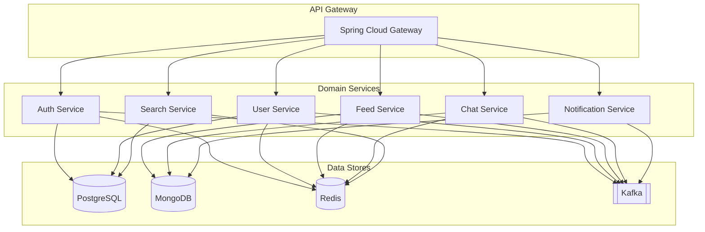
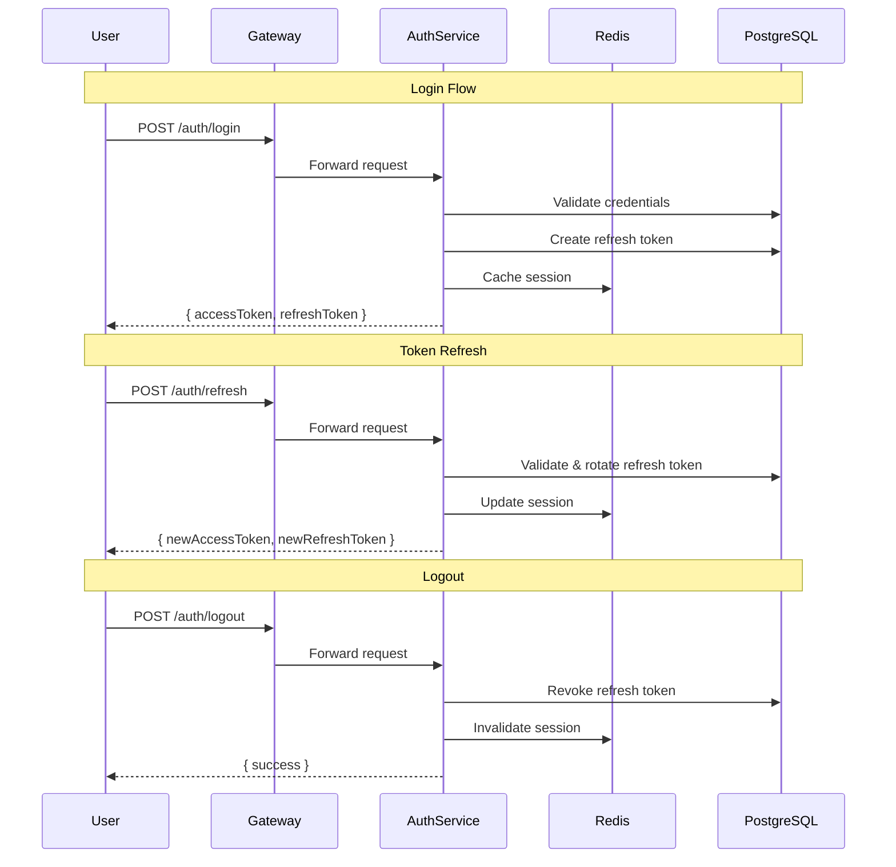
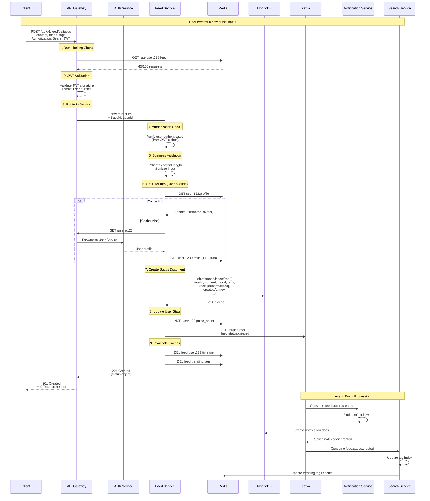
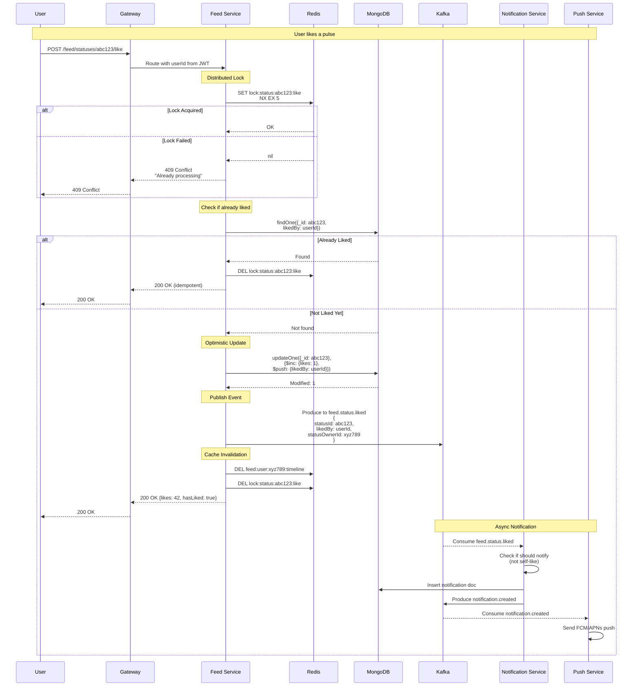
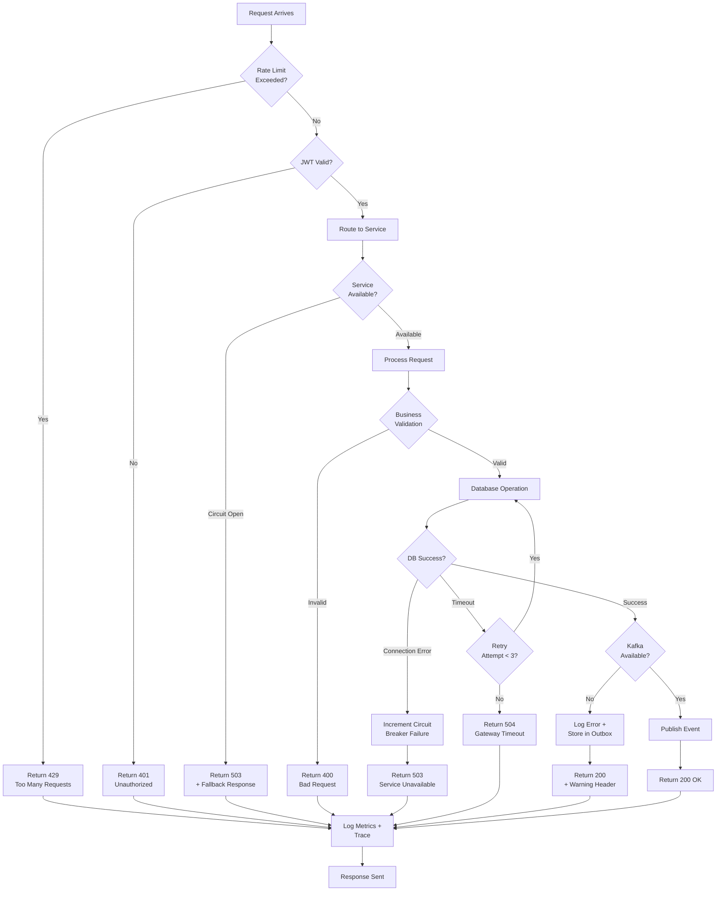
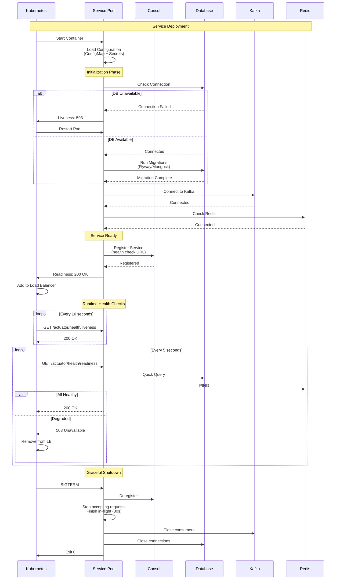

# DayPulse Microservice Backend Architecture

## Executive Summary

**Product Domain**: DayPulse is a social networking platform centered around daily status updates called "pulses." Users share short-form content with moods and tags, follow other users, engage via likes/comments, and communicate through real-time chat with scheduled reminders.

**Key User Flows Identified**:
- Authentication: Register → OTP → Profile Setup → Feed
- Social: Create/view pulses, like, comment, follow users
- Discovery: Search users/tags, trending topics, suggestions
- Messaging: Real-time chat with reminder scheduling
- Notifications: Likes, comments, follows

---

## 1. Service List and Responsibilities



| Service | Responsibility | Data Store | Key Functions |
|---------|---------------|------------|---------------|
| **API Gateway** | Routing, rate limiting, JWT validation, request correlation | Redis (rate limit) | Route to services, circuit breaker |
| **Auth Service** | Authentication, token management, OAuth2/OIDC | PostgreSQL | Login, register, OTP, token refresh |
| **User Service** | User profiles, follows, social graph | PostgreSQL | CRUD profiles, follow/unfollow, followers/following |
| **Feed Service** | Status/pulse management, likes, comments | MongoDB | Create/read pulses, likes, comments, trending |
| **Chat Service** | Real-time messaging, reminders | MongoDB | Messages, chat rooms, reminder jobs |
| **Notification Service** | Push/in-app notifications | MongoDB | Create/read notifications, mark read |
| **Search Service** | User and tag search, suggestions | PostgreSQL + Redis | Full-text search, trending, suggestions |

### Data Store Split Rationale

**PostgreSQL** (Relational, ACID):
- User accounts, credentials (Auth Service)
- User profiles, social graph (User Service)
- Search indices for users (Search Service)

**MongoDB** (Document, Flexible Schema):
- Pulses/statuses with variable tags, reactions (Feed Service)
- Chat messages with flexible metadata (Chat Service)
- Notifications with polymorphic types (Notification Service)

---

## 2. API Contract Draft

### 2.1 Auth Service (`/api/v1/auth`)

| Frontend Call | Backend Endpoint | Method | Request | Response |
|--------------|------------------|--------|---------|----------|
| `login()` | `/auth/login` | POST | `{ email, password }` | `{ user, tokens: { accessToken, refreshToken } }` |
| `register(email)` | `/auth/register` | POST | `{ email, password }` | `{ success: true, email }` |
| `verifyOtp(email, code)` | `/auth/verify-otp` | POST | `{ email, code }` | `{ user, tokens }` |
| `requestPasswordReset(email)` | `/auth/forgot-password` | POST | `{ email }` | `{ success: true }` |
| Google OAuth | `/auth/oauth2/google` | GET | OAuth2 redirect | Redirect to callback |
| Token refresh | `/auth/refresh` | POST | `{ refreshToken }` | `{ accessToken, refreshToken }` |
| Logout | `/auth/logout` | POST | `{ refreshToken }` | `{ success: true }` |

### 2.2 User Service (`/api/v1/users`)

| Frontend Call | Backend Endpoint | Method | Request | Response |
|--------------|------------------|--------|---------|----------|
| `completeSetup(userId, data)` | `/users/me/setup` | POST | `{ name, username, bio }` | `User` |
| `getUserById(id)` | `/users/{id}` | GET | - | `User` |
| Current user | `/users/me` | GET | - | `User` |
| Update profile | `/users/me` | PATCH | `{ name?, username?, bio?, avatar? }` | `User` |
| `getFollowers(userId)` | `/users/{id}/followers` | GET | `?page&size` | `Page<UserSummary>` |
| `getFollowing(userId)` | `/users/{id}/following` | GET | `?page&size` | `Page<UserSummary>` |
| Follow user | `/users/{id}/follow` | POST | - | `{ success: true }` |
| Unfollow user | `/users/{id}/follow` | DELETE | - | `{ success: true }` |
| `getSuggested()` | `/users/suggested` | GET | - | `UserSummary[]` |
| `getAvailableUsers()` | `/users/available` | GET | - | `UserSummary[]` |

### 2.3 Feed Service (`/api/v1/feed`)

| Frontend Call | Backend Endpoint | Method | Request | Response |
|--------------|------------------|--------|---------|----------|
| `getFeed(page, limit)` | `/feed` | GET | `?page&size` | `Page<Status>` |
| `createStatus(content, mood, tags)` | `/feed/statuses` | POST | `{ content, mood, tags[] }` | `Status` |
| `getUserStatuses(userId)` | `/feed/users/{userId}/statuses` | GET | `?page&size` | `Page<Status>` |
| Like status | `/feed/statuses/{id}/like` | POST | - | `{ likes, hasLiked }` |
| Unlike status | `/feed/statuses/{id}/like` | DELETE | - | `{ likes, hasLiked }` |
| `getComments(statusId)` | `/feed/statuses/{id}/comments` | GET | `?page&size` | `Page<Comment>` |
| `addComment(statusId, content)` | `/feed/statuses/{id}/comments` | POST | `{ content }` | `Comment` |
| Get reactions | `/feed/statuses/{id}/reactions` | GET | - | `UserSummary[]` |
| `getTrendingTags()` | `/feed/trending/tags` | GET | - | `TrendingTag[]` |

### 2.4 Chat Service (`/api/v1/chat`)

| Frontend Call | Backend Endpoint | Method | Request | Response |
|--------------|------------------|--------|---------|----------|
| `getChats()` | `/chat/rooms` | GET | - | `ChatRoom[]` |
| `getChat(id)` | `/chat/rooms/{id}` | GET | - | `ChatRoom` |
| `createChat(targetUserId)` | `/chat/rooms` | POST | `{ participantId }` | `ChatRoom` |
| `getMessages(chatId)` | `/chat/rooms/{id}/messages` | GET | `?before&limit` | `Message[]` |
| Send message | `/chat/rooms/{id}/messages` | POST | `{ text, type }` | `Message` |
| WebSocket | `/ws/chat` | WS | - | Real-time messages |
| `getReminders(chatId)` | `/chat/rooms/{id}/reminders` | GET | - | `ReminderJob[]` |
| Create reminder | `/chat/rooms/{id}/reminders` | POST | `{ time, type, target, content }` | `ReminderJob` |
| Update reminder | `/chat/rooms/{id}/reminders/{rid}` | PUT | `{ ... }` | `ReminderJob` |
| Delete reminder | `/chat/rooms/{id}/reminders/{rid}` | DELETE | - | `{ success }` |

### 2.5 Notification Service (`/api/v1/notifications`)

| Frontend Call | Backend Endpoint | Method | Request | Response |
|--------------|------------------|--------|---------|----------|
| `getNotifications()` | `/notifications` | GET | `?page&size` | `Page<Notification>` |
| Mark as read | `/notifications/{id}/read` | POST | - | `{ success }` |
| Mark all read | `/notifications/read-all` | POST | - | `{ success }` |
| Unread count | `/notifications/unread-count` | GET | - | `{ count }` |

### 2.6 Search Service (`/api/v1/search`)

| Frontend Call | Backend Endpoint | Method | Request | Response |
|--------------|------------------|--------|---------|----------|
| `search(query)` | `/search` | GET | `?q&type` | `{ users[], tags[] }` |
| Search users | `/search/users` | GET | `?q&page&size` | `Page<UserSummary>` |
| Search tags | `/search/tags` | GET | `?q` | `string[]` |

---

## 3. Data Model

### 3.1 PostgreSQL Tables (Auth + User + Search Services)

```sql
-- Auth Service
CREATE TABLE users_auth (
    id UUID PRIMARY KEY DEFAULT gen_random_uuid(),
    email VARCHAR(255) UNIQUE NOT NULL,
    password_hash VARCHAR(255),
    oauth_provider VARCHAR(50),
    oauth_id VARCHAR(255),
    is_email_verified BOOLEAN DEFAULT FALSE,
    is_setup_complete BOOLEAN DEFAULT FALSE,
    created_at TIMESTAMP DEFAULT NOW(),
    updated_at TIMESTAMP DEFAULT NOW(),
    UNIQUE(oauth_provider, oauth_id)
);

CREATE TABLE otp_codes (
    id UUID PRIMARY KEY DEFAULT gen_random_uuid(),
    user_id UUID REFERENCES users_auth(id),
    code VARCHAR(6) NOT NULL,
    type VARCHAR(20) NOT NULL, -- 'email_verify', 'password_reset'
    expires_at TIMESTAMP NOT NULL,
    used_at TIMESTAMP,
    created_at TIMESTAMP DEFAULT NOW()
);

CREATE TABLE refresh_tokens (
    id UUID PRIMARY KEY DEFAULT gen_random_uuid(),
    user_id UUID REFERENCES users_auth(id),
    token_hash VARCHAR(255) NOT NULL,
    device_info JSONB,
    expires_at TIMESTAMP NOT NULL,
    revoked_at TIMESTAMP,
    created_at TIMESTAMP DEFAULT NOW()
);

-- User Service
CREATE TABLE user_profiles (
    id UUID PRIMARY KEY, -- Same as users_auth.id
    username VARCHAR(50) UNIQUE NOT NULL,
    name VARCHAR(100) NOT NULL,
    bio TEXT,
    avatar_url VARCHAR(500),
    timezone VARCHAR(50) DEFAULT 'UTC',
    language VARCHAR(5) DEFAULT 'en',
    streak INTEGER DEFAULT 0,
    last_pulse_at TIMESTAMP,
    is_online BOOLEAN DEFAULT FALSE,
    last_seen_at TIMESTAMP,
    created_at TIMESTAMP DEFAULT NOW(),
    updated_at TIMESTAMP DEFAULT NOW()
);

CREATE TABLE follows (
    follower_id UUID REFERENCES user_profiles(id),
    following_id UUID REFERENCES user_profiles(id),
    created_at TIMESTAMP DEFAULT NOW(),
    PRIMARY KEY (follower_id, following_id)
);

-- Materialized counts for performance
CREATE TABLE user_stats (
    user_id UUID PRIMARY KEY REFERENCES user_profiles(id),
    followers_count INTEGER DEFAULT 0,
    following_count INTEGER DEFAULT 0,
    pulses_count INTEGER DEFAULT 0,
    updated_at TIMESTAMP DEFAULT NOW()
);

-- Search optimization
CREATE INDEX idx_profiles_username_trgm ON user_profiles USING gin (username gin_trgm_ops);
CREATE INDEX idx_profiles_name_trgm ON user_profiles USING gin (name gin_trgm_ops);
```

### 3.2 MongoDB Collections (Feed + Chat + Notification Services)

```javascript
// Feed Service - statuses collection
{
  _id: ObjectId,
  userId: UUID,                    // FK to PostgreSQL
  content: String,                 // max 280 chars
  mood: String,                    // emoji
  tags: [String],
  likes: Number,
  commentsCount: Number,
  likedBy: [UUID],                 // Embedded for small counts
  createdAt: ISODate,
  updatedAt: ISODate,
  // Denormalized user data for read performance
  user: {
    id: UUID,
    name: String,
    username: String,
    avatar: String
  }
}
// Indexes: { userId: 1 }, { createdAt: -1 }, { tags: 1 }, { "user.id": 1 }

// Feed Service - comments collection
{
  _id: ObjectId,
  statusId: ObjectId,
  userId: UUID,
  userName: String,                // Denormalized
  content: String,
  createdAt: ISODate
}
// Indexes: { statusId: 1, createdAt: -1 }

// Chat Service - chat_rooms collection
{
  _id: ObjectId,
  participants: [UUID],            // Always 2 for DM
  lastMessage: {
    id: ObjectId,
    senderId: UUID,
    text: String,
    type: String,
    createdAt: ISODate
  },
  unreadCounts: {
    "<userId1>": Number,
    "<userId2>": Number
  },
  createdAt: ISODate,
  updatedAt: ISODate
}
// Indexes: { participants: 1 }, { updatedAt: -1 }

// Chat Service - messages collection
{
  _id: ObjectId,
  chatId: ObjectId,
  senderId: UUID,
  text: String,
  type: String,                    // 'text', 'reaction', 'system'
  reaction: String,                // Optional emoji
  readBy: [UUID],
  createdAt: ISODate
}
// Indexes: { chatId: 1, createdAt: -1 }

// Chat Service - reminders collection
{
  _id: ObjectId,
  chatId: ObjectId,
  createdBy: UUID,
  time: String,                    // "HH:mm"
  type: String,                    // 'once', 'daily'
  target: String,                  // 'self', 'partner', 'both'
  content: String,
  enabled: Boolean,
  nextRunAt: ISODate,              // For scheduler
  createdAt: ISODate,
  updatedAt: ISODate
}
// Indexes: { chatId: 1 }, { nextRunAt: 1, enabled: 1 }

// Notification Service - notifications collection
{
  _id: ObjectId,
  userId: UUID,                    // Recipient
  type: String,                    // 'like', 'comment', 'follow'
  actor: {
    id: UUID,
    name: String,
    username: String,
    avatar: String
  },
  pulseId: ObjectId,               // Optional
  content: String,                 // Comment preview
  isRead: Boolean,
  createdAt: ISODate
}
// Indexes: { userId: 1, createdAt: -1 }, { userId: 1, isRead: 1 }
```

---

## 4. Kafka Topics and Events

### Topic Naming Convention
`{domain}.{entity}.{event}` with versioning via headers

### Topics

| Topic | Producer | Consumers | Purpose |
|-------|----------|-----------|---------|
| `auth.user.registered` | Auth | User, Notification | New user created |
| `auth.user.verified` | Auth | User | Email verified |
| `user.profile.updated` | User | Feed, Chat, Search | Profile changes |
| `user.follow.created` | User | Notification, Feed | New follow |
| `user.follow.deleted` | User | Feed | Unfollow |
| `feed.status.created` | Feed | Notification, Search | New pulse |
| `feed.status.liked` | Feed | Notification | Pulse liked |
| `feed.comment.created` | Feed | Notification | New comment |
| `chat.message.sent` | Chat | Notification | New message |
| `chat.reminder.triggered` | Chat | Notification | Reminder fired |
| `notification.created` | Notification | (Push gateway) | Push notifications |

### Event Envelope Schema

```json
{
  "metadata": {
    "eventId": "uuid-v4",
    "eventType": "user.follow.created",
    "version": "1.0",
    "timestamp": "2026-01-18T10:30:00Z",
    "traceId": "trace-uuid",
    "spanId": "span-uuid",
    "source": "user-service",
    "tenantId": "default"
  },
  "payload": {
    "followerId": "user-uuid-1",
    "followingId": "user-uuid-2",
    "createdAt": "2026-01-18T10:30:00Z"
  }
}
```

### Sample Events

```json
// feed.status.created
{
  "metadata": { "eventType": "feed.status.created", "version": "1.0", ... },
  "payload": {
    "statusId": "mongo-object-id",
    "userId": "user-uuid",
    "content": "Hello world! #daypulse",
    "mood": "😊",
    "tags": ["daypulse"],
    "createdAt": "2026-01-18T10:30:00Z"
  }
}

// chat.message.sent
{
  "metadata": { "eventType": "chat.message.sent", "version": "1.0", ... },
  "payload": {
    "messageId": "mongo-object-id",
    "chatId": "chat-mongo-id",
    "senderId": "user-uuid",
    "recipientIds": ["user-uuid-2"],
    "type": "text",
    "createdAt": "2026-01-18T10:30:00Z"
  }
}
```

---

## 5. Redis Strategy

### 5.1 Cache Patterns

| Key Pattern | Data | TTL | Service |
|-------------|------|-----|---------|
| `user:{id}:profile` | User profile JSON | 15 min | User |
| `user:{id}:stats` | Follower/following counts | 5 min | User |
| `feed:user:{id}:timeline` | List of status IDs | 10 min | Feed |
| `feed:trending:tags` | Top trending tags | 5 min | Feed |
| `feed:suggested:users` | Suggested user IDs | 30 min | Search |
| `chat:room:{id}:recent` | Recent messages | 5 min | Chat |
| `notif:user:{id}:unread` | Unread count | 2 min | Notification |
| `session:{token}` | Session data | 24h | Auth |
| `rate:{ip}:{endpoint}` | Request count | 1 min | Gateway |

### 5.2 Distributed Locking

**Pattern**: Redlock with single-node fallback

| Lock Key | Purpose | TTL | Use Case |
|----------|---------|-----|----------|
| `lock:user:{id}:follow` | Prevent double follow | 10s | Follow/unfollow operations |
| `lock:status:{id}:like` | Prevent double like | 5s | Like/unlike operations |
| `lock:chat:create:{user1}:{user2}` | Prevent duplicate rooms | 10s | Chat creation |
| `lock:reminder:{id}:execute` | Prevent duplicate reminder fires | 60s | Reminder scheduler |

### 5.3 Failure Modes

| Failure | Behavior | Recovery |
|---------|----------|----------|
| Cache miss | Fall through to DB | Auto-populate on read |
| Redis unavailable | Bypass cache, serve from DB | Circuit breaker, retry |
| Lock acquisition fails | Return 409 Conflict | Client retry with backoff |
| TTL expiration during write | Stale read possible | Accept eventual consistency |

---

## 6. Security Design

### 6.1 Authentication Recommendation: OAuth 2.1 + JWT

**Why OAuth 2.1 + JWT (not pure OIDC)**:
- OAuth 2.1 enforces PKCE, no implicit flow (more secure)
- JWT for stateless validation at gateway
- OIDC adds unnecessary complexity for internal auth
- Supports Google OAuth2 integration natively

### 6.2 Token Strategy

```
Access Token (JWT):
  - Lifetime: 15 minutes
  - Contains: userId, roles, permissions
  - Signed with RS256 (asymmetric)
  - Validated at API Gateway

Refresh Token (Opaque):
  - Lifetime: 7 days (30 days for "remember me")
  - Stored hashed in PostgreSQL
  - Rotated on each use (sliding window)
  - Revocable per-device
```

### 6.3 Auth Flows



### 6.4 Authorization Model: RBAC + Resource-based

**Roles**:
- `ROLE_USER`: Standard authenticated user
- `ROLE_ADMIN`: Platform administrator

**Resource-based Checks**:
```java
// Example: Only owner can delete status
@PreAuthorize("@statusSecurity.isOwner(#statusId, authentication)")
public void deleteStatus(String statusId) { ... }

// Example: Chat participant check
@PreAuthorize("@chatSecurity.isParticipant(#chatId, authentication)")
public List<Message> getMessages(String chatId) { ... }
```

### 6.5 Service-to-Service Auth

**Pattern**: mTLS + Service Tokens

- Internal services communicate via mTLS (certificate-based)
- Kafka producers/consumers use SASL/SCRAM
- Service accounts with limited permissions
- No user context propagation needed for async events

---

## 7. Operations and Observability

### 7.1 OpenTelemetry Integration

```yaml
# All services export to OTel Collector
Traces:
  - HTTP requests (Spring WebMVC auto-instrumentation)
  - Kafka produce/consume (Micrometer integration)
  - Database queries (JDBC/MongoDB instrumentation)
  - Redis operations
  - Custom spans for business logic

Metrics:
  - JVM metrics (heap, GC, threads)
  - HTTP request latency (p50, p95, p99)
  - Kafka lag per consumer group
  - Cache hit/miss ratio
  - Business metrics (pulses/min, active users)

Logs:
  - Structured JSON (Logback + Logstash encoder)
  - Correlation via traceId, spanId
  - Log levels: ERROR (alerts), WARN, INFO, DEBUG
```

### 7.2 Resiliency Patterns

| Pattern | Implementation | Config |
|---------|---------------|--------|
| **Timeout** | WebClient timeout | 3s for internal, 10s for external |
| **Retry** | Resilience4j | 3 retries, exponential backoff (100ms, 200ms, 400ms) |
| **Circuit Breaker** | Resilience4j | 50% failure rate, 10s open, 5s half-open |
| **Bulkhead** | Semaphore | 10 concurrent calls per downstream |
| **Rate Limiting** | Redis + Gateway | 100 req/min per user, 1000/min per IP |

### 7.3 Deployment Notes

**Database Migrations**:
- Flyway for PostgreSQL (versioned migrations)
- MongoDB migrations via mongock
- Zero-downtime: additive-only schema changes, then backfill

**Configuration**:
```
Priority (high to low):
1. Environment variables (secrets)
2. Spring Cloud Config Server (feature flags)
3. application-{profile}.yml (per-environment)
4. application.yml (defaults)
```

**Container Orchestration** (Assumption: Kubernetes):
```yaml
Resources per service:
  requests: { cpu: 250m, memory: 512Mi }
  limits: { cpu: 1000m, memory: 1Gi }
  
Scaling:
  - HPA based on CPU (target 70%)
  - Feed/Chat: min 3 replicas
  - Auth/User: min 2 replicas
  
Health Checks:
  - Liveness: /actuator/health/liveness
  - Readiness: /actuator/health/readiness
```

**Secrets Management**:
- Database credentials: Kubernetes Secrets / Vault
- JWT signing keys: Vault with rotation
- API keys: Environment variables

---

## 8. System Flows and Runtime Architecture

### 8.1 Complete Request Flow: Create Status Example



**Key Points**:
1. **Gateway**: Single entry point, handles cross-cutting concerns
2. **Cache-Aside Pattern**: Check cache → miss → fetch → populate
3. **Denormalization**: User data embedded in status for read performance
4. **Async Events**: Non-blocking notification delivery
5. **Distributed Tracing**: TraceId flows through entire request

---

### 8.2 API Gateway Configuration

#### Spring Cloud Gateway Routes Configuration

```yaml
# api-gateway/src/main/resources/application.yml
spring:
  cloud:
    gateway:
      routes:
        # Auth Service Routes
        - id: auth-service
          uri: lb://auth-service
          predicates:
            - Path=/api/v1/auth/**
          filters:
            - name: RateLimiter
              args:
                redis-rate-limiter.replenishRate: 10
                redis-rate-limiter.burstCapacity: 20
            - name: CircuitBreaker
              args:
                name: authServiceCircuitBreaker
                fallbackUri: forward:/fallback/auth
        
        # User Service Routes (Protected)
        - id: user-service
          uri: lb://user-service
          predicates:
            - Path=/api/v1/users/**
          filters:
            - JwtAuthenticationFilter  # Custom filter
            - name: Retry
              args:
                retries: 3
                statuses: BAD_GATEWAY,GATEWAY_TIMEOUT
                backoff:
                  firstBackoff: 100ms
                  maxBackoff: 500ms
                  factor: 2
        
        # Feed Service Routes (Protected)
        - id: feed-service
          uri: lb://feed-service
          predicates:
            - Path=/api/v1/feed/**
          filters:
            - JwtAuthenticationFilter
            - AddRequestHeader=X-Gateway-Version, 1.0
            - name: RequestSize
              args:
                maxSize: 5MB
        
        # Chat Service Routes (Protected + WebSocket)
        - id: chat-ws
          uri: lb:ws://chat-service
          predicates:
            - Path=/ws/chat
          filters:
            - JwtAuthenticationFilter
        
        - id: chat-rest
          uri: lb://chat-service
          predicates:
            - Path=/api/v1/chat/**
          filters:
            - JwtAuthenticationFilter
      
      default-filters:
        - name: RequestTracing
          args:
            includeHeaders: true
        - name: ResponseTime
        - DedupeResponseHeader=Access-Control-Allow-Credentials Access-Control-Allow-Origin
      
      globalcors:
        corsConfigurations:
          '[/**]':
            allowedOrigins: 
              - "https://app.daypulse.com"
              - "http://localhost:3000"  # Dev
            allowedMethods:
              - GET
              - POST
              - PUT
              - DELETE
              - PATCH
            allowedHeaders: "*"
            allowCredentials: true
            maxAge: 3600

# Service Discovery
  cloud:
    discovery:
      enabled: true
    consul:
      host: localhost
      port: 8500
      discovery:
        healthCheckPath: /actuator/health
        healthCheckInterval: 10s

# Redis for Rate Limiting
  redis:
    host: ${REDIS_HOST:localhost}
    port: ${REDIS_PORT:6379}
    password: ${REDIS_PASSWORD:}
    timeout: 2000ms
    lettuce:
      pool:
        max-active: 20
        max-idle: 10
        min-idle: 5

# Resilience4j Circuit Breaker
resilience4j:
  circuitbreaker:
    configs:
      default:
        slidingWindowSize: 100
        permittedNumberOfCallsInHalfOpenState: 10
        waitDurationInOpenState: 10s
        failureRateThreshold: 50
        slowCallRateThreshold: 100
        slowCallDurationThreshold: 3s
  
  timelimiter:
    configs:
      default:
        timeoutDuration: 3s

# Observability
management:
  endpoints:
    web:
      exposure:
        include: health,info,metrics,prometheus
  metrics:
    export:
      prometheus:
        enabled: true
  tracing:
    sampling:
      probability: 1.0  # 100% for dev, 0.1 for prod
```

#### Custom JWT Authentication Filter

```java
// api-gateway/src/main/java/com/daypulse/gateway/filter/JwtAuthenticationFilter.java
@Component
public class JwtAuthenticationFilter implements GlobalFilter, Ordered {
    
    @Value("${jwt.public-key}")
    private RSAPublicKey publicKey;
    
    private final RedisTemplate<String, String> redisTemplate;
    
    @Override
    public Mono<Void> filter(ServerWebExchange exchange, GatewayFilterChain chain) {
        ServerHttpRequest request = exchange.getRequest();
        
        // Skip auth for public endpoints
        if (isPublicEndpoint(request.getPath().value())) {
            return chain.filter(exchange);
        }
        
        String token = extractToken(request);
        if (token == null) {
            return onError(exchange, "Missing authorization token", HttpStatus.UNAUTHORIZED);
        }
        
        return validateToken(token)
            .flatMap(claims -> {
                // Check token blacklist (logout)
                return checkTokenRevoked(token)
                    .flatMap(revoked -> {
                        if (revoked) {
                            return onError(exchange, "Token revoked", HttpStatus.UNAUTHORIZED);
                        }
                        
                        // Add user context to request headers
                        ServerHttpRequest mutatedRequest = request.mutate()
                            .header("X-User-Id", claims.getSubject())
                            .header("X-User-Roles", String.join(",", claims.get("roles", List.class)))
                            .build();
                        
                        return chain.filter(exchange.mutate().request(mutatedRequest).build());
                    });
            })
            .onErrorResume(e -> onError(exchange, "Invalid token", HttpStatus.UNAUTHORIZED));
    }
    
    private Mono<Claims> validateToken(String token) {
        return Mono.fromCallable(() -> {
            return Jwts.parserBuilder()
                .setSigningKey(publicKey)
                .build()
                .parseClaimsJws(token)
                .getBody();
        });
    }
    
    private Mono<Boolean> checkTokenRevoked(String token) {
        String tokenHash = DigestUtils.sha256Hex(token);
        return Mono.fromCallable(() -> 
            redisTemplate.hasKey("revoked:token:" + tokenHash)
        );
    }
    
    @Override
    public int getOrder() {
        return -100; // High priority
    }
}
```

---

### 8.3 Service Configuration Structure

#### Auth Service Configuration

```yaml
# auth-service/src/main/resources/application.yml
spring:
  application:
    name: auth-service
  
  datasource:
    url: jdbc:postgresql://${DB_HOST:localhost}:5432/daypulse_auth
    username: ${DB_USER:daypulse}
    password: ${DB_PASSWORD:changeme}
    hikari:
      maximum-pool-size: 20
      minimum-idle: 5
      connection-timeout: 30000
      idle-timeout: 600000
      max-lifetime: 1800000
  
  jpa:
    hibernate:
      ddl-auto: validate  # Use Flyway for migrations
    properties:
      hibernate:
        dialect: org.hibernate.dialect.PostgreSQLDialect
        format_sql: true
        jdbc:
          batch_size: 20
        order_inserts: true
        order_updates: true
  
  flyway:
    enabled: true
    locations: classpath:db/migration
    baseline-on-migrate: true
  
  kafka:
    bootstrap-servers: ${KAFKA_BOOTSTRAP:localhost:9092}
    producer:
      key-serializer: org.apache.kafka.common.serialization.StringSerializer
      value-serializer: org.springframework.kafka.support.serializer.JsonSerializer
      properties:
        "[enable.idempotence]": true
        "[max.in.flight.requests.per.connection]": 5
        "[acks]": all
  
  redis:
    host: ${REDIS_HOST:localhost}
    port: 6379
    lettuce:
      pool:
        max-active: 10
        max-idle: 5

# Custom Application Properties
daypulse:
  auth:
    jwt:
      access-token-validity: 900  # 15 minutes in seconds
      refresh-token-validity: 604800  # 7 days
      issuer: daypulse-auth-service
    otp:
      length: 6
      validity-minutes: 10
      email:
        from: noreply@daypulse.app
    oauth2:
      google:
        client-id: ${GOOGLE_CLIENT_ID}
        client-secret: ${GOOGLE_CLIENT_SECRET}
        redirect-uri: ${BASE_URL}/auth/oauth2/callback/google

# Observability
management:
  endpoints:
    web:
      exposure:
        include: health,info,metrics,prometheus
  metrics:
    tags:
      application: ${spring.application.name}
      environment: ${SPRING_PROFILES_ACTIVE:dev}
  tracing:
    sampling:
      probability: ${OTEL_SAMPLING_RATE:0.1}

# OpenTelemetry
otel:
  exporter:
    otlp:
      endpoint: ${OTEL_COLLECTOR_ENDPOINT:http://localhost:4317}
  resource:
    attributes:
      service.name: ${spring.application.name}
      service.version: ${APP_VERSION:1.0.0}

logging:
  level:
    com.daypulse: ${LOG_LEVEL:INFO}
    org.springframework.security: DEBUG
  pattern:
    console: "%d{yyyy-MM-dd HH:mm:ss} - %msg%n traceId=%X{traceId} spanId=%X{spanId}%n"

---
# Production Profile
spring:
  config:
    activate:
      on-profile: prod
  
  datasource:
    hikari:
      maximum-pool-size: 50
  
  jpa:
    show-sql: false

daypulse:
  auth:
    jwt:
      refresh-token-validity: 2592000  # 30 days for prod

logging:
  level:
    com.daypulse: WARN
    org.springframework: INFO

management:
  tracing:
    sampling:
      probability: 0.01  # 1% sampling in production
```

#### Feed Service Configuration (MongoDB)

```yaml
# feed-service/src/main/resources/application.yml
spring:
  application:
    name: feed-service
  
  data:
    mongodb:
      uri: mongodb://${MONGO_USER:daypulse}:${MONGO_PASSWORD:changeme}@${MONGO_HOST:localhost}:27017/daypulse_feed?authSource=admin
      auto-index-creation: false  # Create indexes via mongock
  
  kafka:
    bootstrap-servers: ${KAFKA_BOOTSTRAP:localhost:9092}
    producer:
      key-serializer: org.apache.kafka.common.serialization.StringSerializer
      value-serializer: org.springframework.kafka.support.serializer.JsonSerializer
    consumer:
      group-id: feed-service-group
      key-deserializer: org.apache.kafka.common.serialization.StringDeserializer
      value-deserializer: org.springframework.kafka.support.serializer.JsonDeserializer
      properties:
        "[spring.json.trusted.packages]": "com.daypulse.events"
      auto-offset-reset: earliest
      enable-auto-commit: false
    listener:
      ack-mode: manual

daypulse:
  feed:
    max-content-length: 280
    trending-tags-limit: 10
    cache:
      timeline-ttl: 600  # 10 minutes
      trending-ttl: 300  # 5 minutes

# WebClient for inter-service communication
  webclient:
    user-service:
      base-url: http://user-service
      timeout: 3000
    notification-service:
      base-url: http://notification-service
      timeout: 5000

resilience4j:
  retry:
    configs:
      default:
        maxAttempts: 3
        waitDuration: 100ms
        exponentialBackoffMultiplier: 2
        retryExceptions:
          - org.springframework.web.client.ResourceAccessException
  
  circuitbreaker:
    configs:
      default:
        slidingWindowSize: 100
        failureRateThreshold: 50
        waitDurationInOpenState: 10000
```

---

### 8.4 Event-Driven Flow: Like Status Example



**Event Processing Guarantees**:
- **At-Least-Once Delivery**: Kafka consumer manual commit after processing
- **Idempotency**: Notification service checks for duplicate notifications
- **Dead Letter Queue**: Failed events moved to DLQ after 3 retries

---

### 8.5 Error Handling and Recovery Flow



**Error Response Structure**:
```json
{
  "error": {
    "code": "FEED_001",
    "message": "Status content exceeds maximum length",
    "details": "Content must be 280 characters or less",
    "timestamp": "2026-01-18T10:30:00Z",
    "traceId": "a1b2c3d4-e5f6-7890",
    "path": "/api/v1/feed/statuses"
  }
}
```

---

### 8.6 Service Startup and Health Check Flow



**Health Check Endpoints**:
```java
// Custom health indicator
@Component
public class DependenciesHealthIndicator implements HealthIndicator {
    
    private final MongoTemplate mongoTemplate;
    private final RedisTemplate redisTemplate;
    private final KafkaTemplate kafkaTemplate;
    
    @Override
    public Health health() {
        try {
            // Check MongoDB
            mongoTemplate.executeCommand("{ ping: 1 }");
            
            // Check Redis
            redisTemplate.opsForValue().get("health:check");
            
            // Check Kafka (admin client)
            kafkaTemplate.getProducerFactory()
                .createProducer().partitionsFor("health-check");
            
            return Health.up()
                .withDetail("mongodb", "UP")
                .withDetail("redis", "UP")
                .withDetail("kafka", "UP")
                .build();
                
        } catch (Exception e) {
            return Health.down()
                .withDetail("error", e.getMessage())
                .build();
        }
    }
}
```

---

### 8.7 Local Development Setup

#### Docker Compose for Infrastructure

```yaml
# docker-compose.yml
version: '3.8'

services:
  postgres:
    image: postgres:15-alpine
    environment:
      POSTGRES_DB: daypulse
      POSTGRES_USER: daypulse
      POSTGRES_PASSWORD: dev_password
    ports:
      - "5432:5432"
    volumes:
      - postgres_data:/var/lib/postgresql/data
  
  mongodb:
    image: mongo:7
    environment:
      MONGO_INITDB_ROOT_USERNAME: daypulse
      MONGO_INITDB_ROOT_PASSWORD: dev_password
    ports:
      - "27017:27017"
    volumes:
      - mongo_data:/data/db
  
  redis:
    image: redis:7-alpine
    ports:
      - "6379:6379"
    command: redis-server --appendonly yes
    volumes:
      - redis_data:/data
  
  zookeeper:
    image: confluentinc/cp-zookeeper:7.5.0
    environment:
      ZOOKEEPER_CLIENT_PORT: 2181
      ZOOKEEPER_TICK_TIME: 2000
  
  kafka:
    image: confluentinc/cp-kafka:7.5.0
    depends_on:
      - zookeeper
    ports:
      - "9092:9092"
    environment:
      KAFKA_BROKER_ID: 1
      KAFKA_ZOOKEEPER_CONNECT: zookeeper:2181
      KAFKA_ADVERTISED_LISTENERS: PLAINTEXT://localhost:9092
      KAFKA_OFFSETS_TOPIC_REPLICATION_FACTOR: 1
  
  consul:
    image: consul:1.16
    ports:
      - "8500:8500"
    command: agent -dev -ui -client=0.0.0.0
  
  jaeger:
    image: jaegertracing/all-in-one:1.50
    ports:
      - "16686:16686"  # UI
      - "4317:4317"    # OTLP gRPC
      - "4318:4318"    # OTLP HTTP
    environment:
      COLLECTOR_OTLP_ENABLED: true

volumes:
  postgres_data:
  mongo_data:
  redis_data:
```

**Start Development Environment**:
```bash
# Start infrastructure
docker-compose up -d

# Wait for services
./scripts/wait-for-services.sh

# Run migrations
cd auth-service && ./mvnw flyway:migrate
cd user-service && ./mvnw flyway:migrate

# Start services (in separate terminals)
cd api-gateway && ./mvnw spring-boot:run
cd auth-service && ./mvnw spring-boot:run -Dspring-boot.run.profiles=dev
cd user-service && ./mvnw spring-boot:run -Dspring-boot.run.profiles=dev
cd feed-service && ./mvnw spring-boot:run -Dspring-boot.run.profiles=dev
cd chat-service && ./mvnw spring-boot:run -Dspring-boot.run.profiles=dev
```

---

## Assumptions Made

1. **Single tenant**: No multi-tenancy required (tenantId in events for future-proofing)
2. **DM only**: Chat is 1:1 direct messages, no group chats
3. **No media uploads**: Avatars use external URLs (CDN integration out of scope)
4. **Moderate scale**: ~100K DAU target (influences caching/sharding decisions)
5. **English + Vietnamese**: i18n handled client-side, server returns keys
6. **No real-time presence**: Online status updated on activity, not WebSocket heartbeat
7. **Push notifications**: External gateway (FCM/APNs) integration not detailed

---

## Service Repository Structure (Recommended)

```
daypulse-backend/
├── api-gateway/
├── auth-service/
├── user-service/
├── feed-service/
├── chat-service/
├── notification-service/
├── search-service/
├── common/
│   ├── common-events/        # Kafka event DTOs
│   ├── common-security/      # JWT utilities
│   └── common-observability/ # OTel config
├── docker-compose.yml        # Local dev
└── k8s/                      # Kubernetes manifests
```
