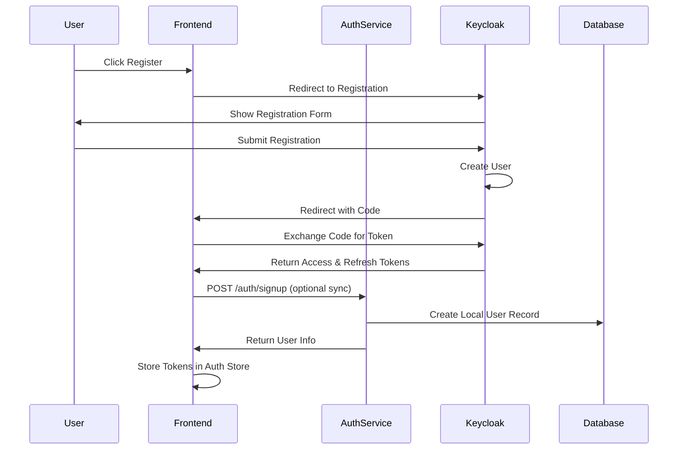
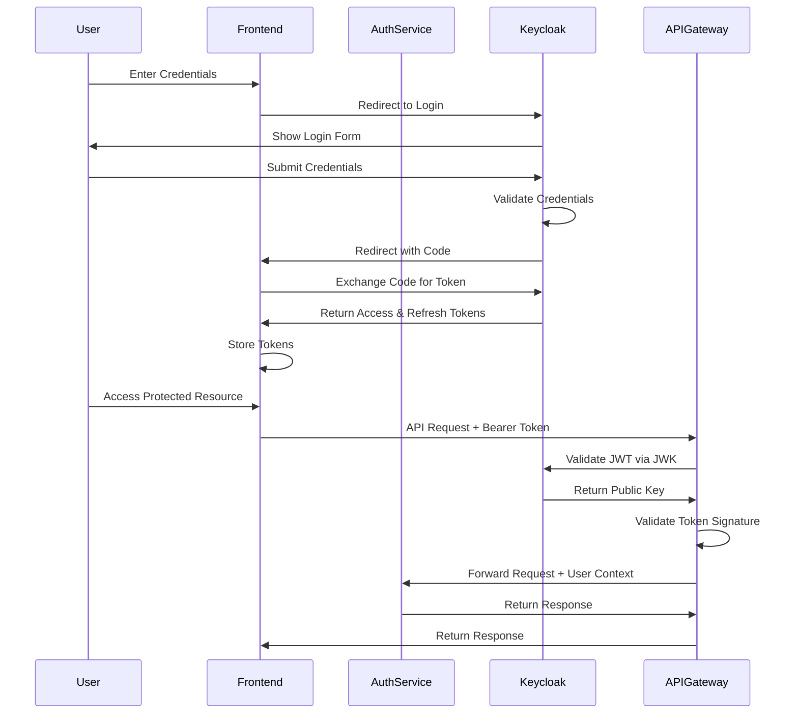
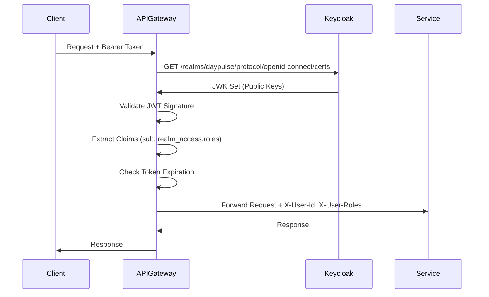

# Keycloak Integration Guide

Complete guide for Keycloak integration in DayPulse microservices architecture.

---

## Table of Contents

- [Architecture Overview](#architecture-overview)
- [Authentication Flow](#authentication-flow)
- [Configuration](#configuration)
- [Backend Integration](#backend-integration)
- [Frontend Integration](#frontend-integration)
- [Token Validation](#token-validation)
- [Troubleshooting](#troubleshooting)

---

## Architecture Overview

### System Architecture

```
┌─────────────────────────────────────────────────────────────┐
│                        Frontend (React)                      │
│  - Keycloak JS Adapter                                      │
│  - Auth Store (Zustand)                                     │
│  - API Client (Axios)                                       │
└────────────────────┬────────────────────────────────────────┘
                     │ HTTPS
                     │ Authorization: Bearer <Keycloak JWT>
                     ▼
┌─────────────────────────────────────────────────────────────┐
│                    API Gateway (Port 8188)                  │
│  - JWT Validation via Keycloak JWK                         │
│  - Role Extraction (realm_access.roles)                    │
│  - Request Forwarding                                       │
└──────────┬──────────────────────┬──────────────────────────┘
           │                      │
           │                      │
    ┌──────▼──────┐        ┌─────▼─────┐
    │Auth Service │        │User Service│
    │ Port 8180   │        │ Port 8181  │
    │             │        │            │
    │- Keycloak   │        │- JWT       │
    │  Admin API │        │  Validation│
    │- Token     │        │- User      │
    │  Exchange  │        │  Profile   │
    └──────┬──────┘        └────────────┘
           │
           ▼
┌─────────────────────────────────────────────────────────────┐
│                  Keycloak Server (Port 8888)                │
│  - Realm: daypulse                                          │
│  - Clients: daypulse-backend, daypulse-frontend            │
│  - Roles: USER, MODERATOR, ADMIN                            │
│  - Users & Authentication                                   │
└─────────────────────────────────────────────────────────────┘
```

### Component Responsibilities

| Component | Responsibility |
|-----------|---------------|
| **Keycloak** | Identity provider, token issuance, user management |
| **Frontend** | User authentication UI, token storage, API calls |
| **API Gateway** | JWT validation, role extraction, request routing |
| **Auth Service** | User registration, token refresh, logout |
| **User Service** | User profile management, protected by JWT |

---

## Authentication Flow

### User Registration Flow



### User Login Flow



### Token Validation Flow



---

## Configuration

### Keycloak Configuration

**Realm**: `daypulse`

**Clients**:

1. **daypulse-backend** (Confidential)
   - Client Authentication: ON
   - Standard Flow: ON
   - Direct Access Grants: ON
   - Service Accounts: ON

2. **daypulse-frontend** (Public)
   - Client Authentication: OFF
   - Standard Flow: ON
   - Direct Access Grants: ON
   - PKCE: S256

**Roles**: USER, MODERATOR, ADMIN

### Backend Configuration

#### Auth Service (`application.yaml`)

```yaml
keycloak:
  realm: daypulse
  auth-server-url: http://localhost:8888
  resource: daypulse-backend
  credentials:
    secret: ${KEYCLOAK_CLIENT_SECRET:your-client-secret-here}
  admin:
    server-url: http://localhost:8888
    realm: master
    client-id: admin-cli
    username: ${KEYCLOAK_ADMIN_USERNAME:admin}
    password: ${KEYCLOAK_ADMIN_PASSWORD:admin}

spring:
  security:
    oauth2:
      resourceserver:
        jwt:
          issuer-uri: http://localhost:8888/realms/daypulse
          jwk-set-uri: http://localhost:8888/realms/daypulse/protocol/openid-connect/certs
```

#### API Gateway (`application.yaml`)

```yaml
keycloak:
  issuer-uri: http://localhost:8888/realms/daypulse
  jwk-set-uri: http://localhost:8888/realms/daypulse/protocol/openid-connect/certs
```

### Frontend Configuration

#### Environment Variables (`.env`)

```env
VITE_KEYCLOAK_URL=http://localhost:8888
VITE_KEYCLOAK_REALM=daypulse
VITE_KEYCLOAK_CLIENT_ID=daypulse-frontend
VITE_API_URL=http://localhost:8188
```

---

## Backend Integration

### Auth Service

#### KeycloakAuthenticationService

The `KeycloakAuthenticationService` handles:

- **User Registration**: Creates users in Keycloak via Admin API
- **User Login**: Exchanges credentials for Keycloak tokens
- **Token Refresh**: Refreshes access tokens using refresh tokens
- **Logout**: Revokes Keycloak sessions
- **Token Introspection**: Validates token status

#### Keycloak Admin Client

Configured in `KeycloakConfig.java`:

```java
@Bean
public Keycloak keycloakAdminClient() {
    return KeycloakBuilder.builder()
            .serverUrl(serverUrl)
            .realm(realm)
            .grantType(OAuth2Constants.PASSWORD)
            .clientId(clientId)
            .username(username)
            .password(password)
            .build();
}
```

### API Gateway

#### JWT Decoder Configuration

Uses Keycloak JWK endpoint for token validation:

```java
@Bean
public ReactiveJwtDecoder jwtDecoder() {
    return NimbusReactiveJwtDecoder.withJwkSetUri(jwkSetUri)
            .build();
}
```

#### JWT Claims Extraction

Keycloak JWT structure:

```json
{
  "sub": "keycloak-user-uuid",
  "preferred_username": "user@example.com",
  "email": "user@example.com",
  "realm_access": {
    "roles": ["USER", "ADMIN"]
  },
  "exp": 1234567890,
  "iat": 1234567890
}
```

The gateway extracts:
- **User ID**: From `sub` claim
- **Roles**: From `realm_access.roles` array
- **Username**: From `preferred_username` or `email`

---

## Frontend Integration

### Keycloak Initialization

Keycloak is initialized in `App.tsx`:

```typescript
useEffect(() => {
  const initializeAuth = async () => {
    const authenticated = await initKeycloak();
    if (authenticated) {
      await syncWithKeycloak();
    }
  };
  initializeAuth();
}, []);
```

### Authentication Methods

#### Login

```typescript
import { keycloakLogin } from '@/services/keycloakService';

// Redirects to Keycloak login page
keycloakLogin();
```

#### Google Login

```typescript
import { keycloakLoginGoogle } from '@/services/keycloakService';

// Redirects to Google OAuth via Keycloak
keycloakLoginGoogle();
```

#### Register

```typescript
import { keycloakRegister } from '@/services/keycloakService';

// Redirects to Keycloak registration page
keycloakRegister();
```

### Token Management

Tokens are automatically:
- Stored in auth store (Zustand with persistence)
- Included in API requests via Axios interceptor
- Refreshed before expiration (handled by Keycloak JS adapter)

---

## Token Validation

### JWT Structure

Keycloak issues JWTs with the following structure:

**Header**:
```json
{
  "alg": "RS256",
  "typ": "JWT",
  "kid": "key-id"
}
```

**Payload**:
```json
{
  "sub": "keycloak-user-uuid",
  "iss": "http://localhost:8888/realms/daypulse",
  "aud": "daypulse-backend",
  "exp": 1234567890,
  "iat": 1234567890,
  "preferred_username": "user@example.com",
  "email": "user@example.com",
  "realm_access": {
    "roles": ["USER"]
  },
  "scope": "openid profile email"
}
```

### Validation Process

1. **Extract Token**: From `Authorization: Bearer <token>` header
2. **Fetch JWK**: Get public keys from Keycloak JWK endpoint
3. **Validate Signature**: Verify token signature using public key
4. **Check Expiration**: Verify token hasn't expired
5. **Extract Claims**: Get user ID and roles from token
6. **Forward Request**: Add user context headers to downstream services

---

## Troubleshooting

### Common Issues

#### 1. Keycloak Connection Failed

**Symptoms**: 
- Cannot connect to Keycloak
- 401 Unauthorized errors

**Solutions**:
- Verify Keycloak is running: `docker-compose ps`
- Check Keycloak logs: `docker-compose logs keycloak`
- Verify URL in configuration: `http://localhost:8888`
- Check network connectivity

#### 2. Invalid Client Secret

**Symptoms**:
- 401 Unauthorized when calling Keycloak
- "Invalid client credentials" error

**Solutions**:
- Get client secret from Keycloak Admin Console
- Update `application.yaml` or set environment variable
- Verify client ID matches: `daypulse-backend`

#### 3. JWT Validation Fails

**Symptoms**:
- 401 Unauthorized in API Gateway
- "Invalid token" errors

**Solutions**:
- Verify JWK endpoint is accessible
- Check token is from correct realm
- Verify token hasn't expired
- Check token signature is valid

#### 4. Roles Not Extracted

**Symptoms**:
- User has no roles
- Access denied for protected resources

**Solutions**:
- Verify roles exist in Keycloak realm
- Check user has roles assigned
- Verify `realm_access.roles` claim in token
- Check role extraction logic in gateway

#### 5. Frontend Not Authenticating

**Symptoms**:
- Login redirects but doesn't return
- Tokens not stored

**Solutions**:
- Check Keycloak client configuration
- Verify redirect URIs match exactly
- Check browser console for errors
- Verify Keycloak JS adapter is initialized

### Debugging Tips

#### Enable Debug Logging

**Backend** (`application.yaml`):
```yaml
logging:
  level:
    org.springframework.security: DEBUG
    org.springframework.security.oauth2: DEBUG
    com.daypulse: DEBUG
```

**Frontend**:
```typescript
// In keycloakService.ts
keycloak.onTokenExpired = () => {
  console.log('Token expired');
};
```

#### Inspect JWT Tokens

Use [jwt.io](https://jwt.io) to decode and inspect JWT tokens:

1. Copy the access token
2. Paste into jwt.io
3. Verify claims and expiration

#### Check Keycloak Logs

```bash
docker-compose logs -f keycloak
```

Look for:
- Authentication attempts
- Token generation
- Error messages

---

## Security Considerations

### Production Checklist

- [ ] Change default admin credentials
- [ ] Use HTTPS for Keycloak
- [ ] Use strong client secrets
- [ ] Enable token rotation
- [ ] Configure proper session timeouts
- [ ] Set up proper CORS policies
- [ ] Enable audit logging
- [ ] Use production database
- [ ] Set up backup strategy
- [ ] Configure proper password policies

### Token Security

- Tokens are stored in memory (frontend)
- Tokens are not logged
- Tokens are transmitted over HTTPS (production)
- Token expiration is enforced
- Refresh tokens are rotated

---

## Additional Resources

- [Keycloak Documentation](https://www.keycloak.org/documentation)
- [Keycloak Setup Guide](../keycloak-setup.md)
- [Testing Guide](TESTING_KEYCLOAK.md)
- [API Reference](API_REFERENCE.md)
