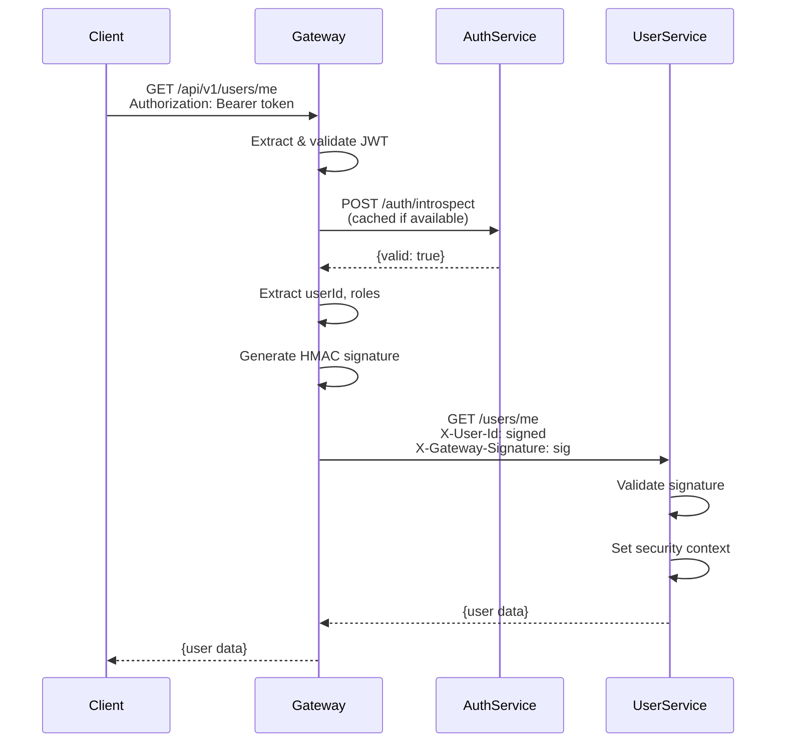

# DayPulse Security Architecture

Complete security documentation for the DayPulse microservices backend.

---

## Table of Contents

- [Overview](#overview)
- [Authentication Flow](#authentication-flow)
- [Authorization Model](#authorization-model)
- [Service-to-Service Authentication](#service-to-service-authentication)
- [Security Headers](#security-headers)
- [Token Management](#token-management)
- [Security Best Practices](#security-best-practices)

---

## Overview

DayPulse implements a centralized authentication and authorization system using JWT tokens with the following security principles:

1. **Centralized Authentication**: All authentication happens at the API Gateway
2. **Service-to-Service Trust**: Downstream services validate requests from the gateway
3. **Role-Based Access Control (RBAC)**: Authorization based on user roles
4. **Token Validation**: Multi-layer validation (signature, expiration, revocation)
5. **Defense in Depth**: Multiple security layers to prevent unauthorized access

---

## Authentication Flow

### Client to Gateway

```
Client → API Gateway (JWT Validation) → Auth Service (Introspection) → Downstream Service
```

#### Step-by-Step Flow

1. **Client Request**
   - Client sends request with `Authorization: Bearer <access_token>` header
   - Token is a JWT signed with HS512 algorithm

2. **Gateway JWT Validation** (`GatewayJwtAuthenticationFilter`)
   - Extract token from `Authorization` header
   - Validate JWT signature using shared secret key
   - Check token expiration (`exp` claim)
   - Extract user claims (`userId`, `scope`, `sub`)

3. **Token Introspection** (with caching)
   - Call Auth Service `/auth/introspect` endpoint
   - Verify token is not revoked
   - Cache result for 30 seconds to reduce load

4. **User Context Extraction**
   - Extract `userId` from JWT `userId` claim
   - Extract roles from JWT `scope` claim (space-separated)
   - Create Spring Security `Authentication` object

5. **Service-to-Service Headers**
   - Add `X-User-Id` header with user ID
   - Add `X-User-Roles` header with user roles
   - Add `X-Gateway-Signature` header with HMAC signature
   - Add `X-Gateway-Timestamp` header with request timestamp

6. **Forward to Downstream Service**
   - Gateway forwards request with authenticated user context
   - Downstream service validates gateway headers

### Gateway to Downstream Service

#### User Service Validation (`GatewayHeaderValidationFilter`)

1. **Header Validation**
   - Verify required headers are present:
     - `X-User-Id`
     - `X-Gateway-Signature`
     - `X-Gateway-Timestamp`

2. **Timestamp Validation**
   - Check timestamp is within 5 minutes (prevents replay attacks)
   - Reject requests with invalid or expired timestamps

3. **Signature Verification**
   - Reconstruct signature using:
     - User ID
     - Roles
     - Timestamp
     - Shared secret key (same as JWT signing key)
   - Compare with provided signature

4. **Security Context Setup**
   - Extract user ID and roles from validated headers
   - Create Spring Security `Authentication` object
   - Set in `SecurityContextHolder` for controller access

---

## Authorization Model

### Role-Based Access Control (RBAC)

DayPulse uses a role-based authorization model with the following roles:

| Role | Description | Access Level |
|------|-------------|--------------|
| `ROLE_USER` | Default role for all authenticated users | Standard user endpoints |
| `ROLE_MODERATOR` | Content moderation permissions | User + moderation endpoints |
| `ROLE_ADMIN` | Full system access | All endpoints |

### Authorization Enforcement

#### Gateway Level (`GatewayAuthorizationFilter`)

- Validates user roles against endpoint requirements
- Returns `403 Forbidden` for insufficient permissions
- Admin role has access to all endpoints

#### Endpoint Protection

**Public Endpoints** (no authentication required):
- `/api/v1/auth/signup`
- `/api/v1/auth/login`
- `/api/v1/auth/refresh`
- `/api/v1/auth/introspect`
- `/api/v1/auth/verify-otp`
- `/api/v1/auth/forgot-password`

**Protected Endpoints** (authentication required):
- `/api/v1/auth/logout`
- `/api/v1/users/**`

**Admin Endpoints** (admin role required):
- `/api/v1/admin/**`

**Moderator Endpoints** (moderator role required):
- `/api/v1/moderator/**`

---

## Service-to-Service Authentication

### Overview

To prevent header injection attacks, the gateway signs all requests to downstream services using HMAC-SHA256.

### Signature Generation

**Gateway Side** (`ServiceAuthenticationUtil`):

```java
String dataToSign = String.format("%s|%s|%d", userId, roles, timestamp);
String signature = HMAC_SHA256(dataToSign, sharedSecretKey);
```

**Components**:
- `userId`: User ID from JWT
- `roles`: Space-separated roles (e.g., "ROLE_USER ROLE_ADMIN")
- `timestamp`: Unix timestamp in seconds
- `sharedSecretKey`: Base64-encoded secret (same as JWT signing key)

### Signature Verification

**Downstream Service Side** (`GatewayHeaderValidationFilter`):

1. Extract headers: `X-User-Id`, `X-User-Roles`, `X-Gateway-Signature`, `X-Gateway-Timestamp`
2. Validate timestamp (within 5 minutes)
3. Reconstruct signature using same algorithm
4. Compare with provided signature
5. Reject if signature doesn't match or timestamp is invalid

### Security Properties

- **Replay Attack Prevention**: Timestamp validation ensures requests are recent
- **Header Injection Prevention**: Signature verification ensures headers come from gateway
- **Non-Repudiation**: Signature proves request origin

---

## Security Headers

### Gateway to Downstream Service Headers

| Header | Description | Example |
|--------|-------------|---------|
| `X-User-Id` | Authenticated user ID | `550e8400-e29b-41d4-a716-446655440000` |
| `X-User-Roles` | Space-separated user roles | `ROLE_USER ROLE_ADMIN` |
| `X-Gateway-Signature` | HMAC-SHA256 signature | `Base64-encoded-signature` |
| `X-Gateway-Timestamp` | Request timestamp (Unix seconds) | `1704067200` |

### Client to Gateway Headers

| Header | Description | Example |
|--------|-------------|---------|
| `Authorization` | Bearer token | `Bearer eyJhbGciOiJIUzUxMiJ9...` |

---

## Token Management

### Access Token

**Format**: JWT (JSON Web Token)

**Algorithm**: HS512 (HMAC with SHA-512)

**Expiration**: 1 hour (3600 seconds)

**Claims**:
- `sub`: User email (subject)
- `userId`: User UUID
- `scope`: Space-separated roles (e.g., "ROLE_USER ROLE_ADMIN")
- `iss`: Issuer ("daypulse-auth-service")
- `exp`: Expiration time (Unix timestamp)
- `iat`: Issued at time (Unix timestamp)
- `jti`: JWT ID (unique token identifier)

**Storage**: Client-side (localStorage, sessionStorage, or memory)

**Transport**: `Authorization: Bearer <token>` header

### Refresh Token

**Format**: JWT

**Algorithm**: HS512

**Expiration**: 10 hours (36000 seconds)

**Storage**: 
- Database (hashed with MD5)
- Client-side (for refresh requests)

**Rotation**: New token generated on each refresh, old token revoked

**Transport**: Request body in `/auth/refresh` endpoint

### Token Validation Flow

1. **Local Validation** (Gateway)
   - Verify signature
   - Check expiration
   - Extract claims

2. **Remote Validation** (Auth Service)
   - Check token revocation status
   - Verify token exists in system
   - Cached for 30 seconds

3. **Blacklist Check** (Future)
   - Redis-based token blacklist
   - Instant revocation support

---

## Security Best Practices

### Implemented

✅ **JWT Signature Validation**: All tokens are cryptographically signed  
✅ **Token Expiration**: Short-lived access tokens (1 hour)  
✅ **Token Revocation**: Introspection endpoint checks revocation status  
✅ **Service-to-Service Authentication**: HMAC signatures prevent header injection  
✅ **Timestamp Validation**: Prevents replay attacks  
✅ **Role-Based Access Control**: Authorization at gateway level  
✅ **Error Handling**: Proper 401/403 responses instead of silent failures  
✅ **Security Context**: User information extracted from validated sources  

### Recommended for Production

🔲 **HTTPS Only**: Enforce TLS/SSL for all communications  
🔲 **Rate Limiting**: Implement rate limiting on authentication endpoints  
🔲 **Token Blacklist**: Redis-based blacklist for instant revocation  
🔲 **Audit Logging**: Log all authentication and authorization events  
🔲 **IP Whitelisting**: Restrict service-to-service communication to known IPs  
🔲 **Secrets Management**: Use external secrets management (Vault, AWS Secrets Manager)  
🔲 **Token Rotation**: Implement automatic token rotation  
🔲 **Multi-Factor Authentication**: Add MFA for sensitive operations  
🔲 **CORS Configuration**: Restrict CORS to known origins  
🔲 **Security Headers**: Add security headers (X-Frame-Options, CSP, etc.)  

---

## Security Constants

All security-related constants are centralized in:

- **API Gateway**: `com.daypulse.api_gateway.security.SecurityConstants`
- **User Service**: `com.daypulse.user_service.security.SecurityConstants`

### Key Constants

```java
// Header Names
HEADER_USER_ID = "X-User-Id"
HEADER_USER_ROLES = "X-User-Roles"
HEADER_GATEWAY_SIGNATURE = "X-Gateway-Signature"
HEADER_GATEWAY_TIMESTAMP = "X-Gateway-Timestamp"

// JWT Claims
CLAIM_USER_ID = "userId"
CLAIM_SCOPE = "scope"
CLAIM_SUBJECT = "sub"

// Security Parameters
MAX_SIGNATURE_AGE_SECONDS = 300  // 5 minutes
INTROSPECTION_CACHE_TTL_SECONDS = 30
```

---

## Error Handling

### Authentication Errors (401 Unauthorized)

**Causes**:
- Missing or invalid JWT token
- Expired token
- Revoked token
- Invalid signature

**Response**:
```json
{
  "code": 401,
  "message": "Token is invalid or revoked",
  "result": null
}
```

### Authorization Errors (403 Forbidden)

**Causes**:
- Insufficient permissions
- Missing required role

**Response**:
```json
{
  "code": 403,
  "message": "Insufficient permissions. Required role: ROLE_ADMIN",
  "result": null
}
```

---

## Security Architecture Diagram



---

## Security Checklist

When adding new endpoints or services:

- [ ] Define public vs protected endpoints in `SecurityConfig`
- [ ] Add role requirements if needed in `GatewayAuthorizationFilter`
- [ ] Ensure user-service validates gateway headers
- [ ] Use `CurrentUser` utility instead of manual header extraction
- [ ] Add proper error handling for authentication/authorization failures
- [ ] Update security documentation
- [ ] Test with invalid tokens and signatures
- [ ] Verify timestamp validation works correctly

---

## References

- [OAuth 2.0 Bearer Token Usage (RFC 6750)](https://tools.ietf.org/html/rfc6750)
- [JSON Web Token (JWT) RFC 7519](https://tools.ietf.org/html/rfc7519)
- [Spring Security Documentation](https://docs.spring.io/spring-security/reference/index.html)
- [Spring Cloud Gateway Documentation](https://spring.io/projects/spring-cloud-gateway)
