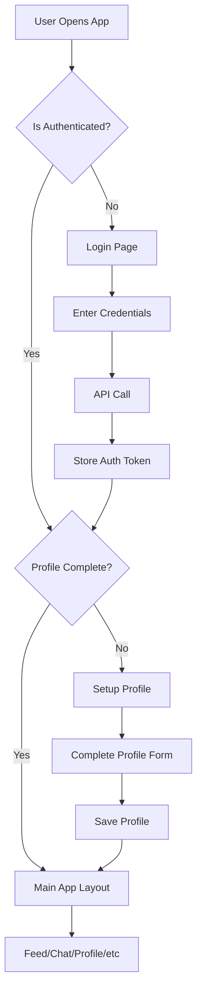

# DayPulse Architecture Guide for React Beginners

## Table of Contents
1. [Application Entry Point](#application-entry-point)
2. [Application Flow](#application-flow)
3. [Feature Flows](#feature-flows)
4. [Data Flow Patterns](#data-flow-patterns)
5. [Component Communication](#component-communication)

---

## Application Entry Point

### How the App Starts

```
index.html (Browser loads this)
    ↓
src/index.tsx (JavaScript entry point)
    ↓
src/app/App.tsx (Main React component)
    ↓
src/app/providers.tsx (Setup providers)
    ↓
src/app/routes.tsx (Route definitions)
    ↓
Feature Pages (Lazy loaded when needed)
```

### Step-by-Step Explanation

**1. index.html**
```html
<!-- The browser loads this file first -->
<div id="root"></div>
<script type="module" src="/src/index.tsx"></script>
```

**2. src/index.tsx**
```typescript
// Creates React app and mounts it to the DOM
const root = ReactDOM.createRoot(document.getElementById('root'));
root.render(<App />);
```

**3. src/app/App.tsx**
```typescript
// Main app component that:
// - Manages dark/light theme
// - Wraps everything with Providers
// - Renders routes
```

**4. src/app/providers.tsx**
```typescript
// Sets up:
// - React Query (for data fetching)
// - React Router (for navigation)
// - Toast notifications
```

**5. src/app/routes.tsx**
```typescript
// Defines all routes with lazy loading
// Example: /login → Login page
//          /feed → Feed page
```

---

## Application Flow

### User Journey Flow



### Authentication Flow

```
┌─────────────────────────────────────────────────────────┐
│ 1. User visits app                                       │
│    → App checks useAuthStore.isAuthenticated            │
└─────────────────────────────────────────────────────────┘
                          ↓
┌─────────────────────────────────────────────────────────┐
│ 2. If NOT authenticated                                  │
│    → ProtectedRoute redirects to /login                 │
└─────────────────────────────────────────────────────────┘
                          ↓
┌─────────────────────────────────────────────────────────┐
│ 3. User enters credentials on Login page                │
│    → mockService.login() called                         │
│    → Returns user data + tokens                         │
└─────────────────────────────────────────────────────────┘
                          ↓
┌─────────────────────────────────────────────────────────┐
│ 4. Store authentication                                  │
│    → useAuthStore.setAuth(user, tokens)                 │
│    → Saved to localStorage via Zustand persist          │
└─────────────────────────────────────────────────────────┘
                          ↓
┌─────────────────────────────────────────────────────────┐
│ 5. Check profile completion                              │
│    → If user.isSetupComplete = false                    │
│    → Redirect to /setup-profile                         │
│    → Otherwise redirect to /feed                        │
└─────────────────────────────────────────────────────────┘
```

---

## Feature Flows

### 1. Feed Feature Flow

**Location**: `src/features/feed/`

```
User opens /feed
    ↓
Feed.tsx component loads
    ↓
useFeed() hook executes
    ↓
React Query fetches data from mockService.getFeed()
    ↓
Data returned and cached
    ↓
Feed.tsx renders:
    - StatusComposer (for creating posts)
    - StatusCard (for each post)
    - Infinite scroll loader
```

**Creating a Post Flow:**

```typescript
// 1. User types in StatusComposer
<StatusComposer />
    ↓
// 2. User clicks "Post" button
handlePost() called
    ↓
// 3. Mutation executes
createMutation.mutate({ content, mood, tags })
    ↓
// 4. API call
mockService.createStatus()
    ↓
// 5. Update cache optimistically
queryClient.setQueryData(['feed'], ...)
    ↓
// 6. UI updates immediately
New post appears at top of feed
```

**Key Files:**
- `pages/Feed.tsx` - Main feed page (200 lines, refactored)
- `components/StatusComposer.tsx` - Post creation form
- `components/StatusCard.tsx` - Individual post display
- `hooks/useFeed.ts` - Data fetching logic

### 2. Authentication Feature Flow

**Location**: `src/features/auth/`

**Login Flow:**
```
User navigates to /login
    ↓
Login.tsx renders
    ↓
User fills form and submits
    ↓
handleLogin() called
    ↓
mockService.login() - API call
    ↓
setAuth(user, tokens) - Store in Zustand
    ↓
Navigate to /feed or /setup-profile
```

**Registration Flow:**
```
User navigates to /register
    ↓
Register.tsx renders
    ↓
User enters email and submits
    ↓
mockService.register(email)
    ↓
Navigate to /verify-otp
    ↓
User enters OTP code
    ↓
mockService.verifyOtp(email, code)
    ↓
Returns incomplete user (isSetupComplete: false)
    ↓
Navigate to /setup-profile
    ↓
User completes profile
    ↓
mockService.completeSetup(data)
    ↓
Navigate to /feed
```

**Key Files:**
- `pages/Login.tsx` - Login form
- `pages/Register.tsx` - Registration form
- `pages/VerifyOTP.tsx` - OTP verification
- `pages/SetupProfile.tsx` - Profile completion
- `pages/ForgotPassword.tsx` - Password reset

### 3. Chat Feature Flow

**Location**: `src/features/chat/`

**Chat List Flow:**
```
User navigates to /chat
    ↓
ChatList.tsx renders
    ↓
useQuery fetches mockService.getChats()
    ↓
Displays list of conversations with:
    - Partner avatar and name
    - Last message preview
    - Unread count badge
    ↓
User clicks on a chat
    ↓
Navigate to /chat/:id
```

**Chat Room Flow:**
```
User opens /chat/:id
    ↓
ChatRoom.tsx renders
    ↓
Two queries execute in parallel:
    - getChat(id) - Chat metadata
    - getMessages(id) - Message history
    ↓
Display:
    - Chat header with partner info
    - Message list (scrollable)
    - Input field at bottom
    ↓
User types and sends message
    ↓
sendMutation.mutate(text)
    ↓
Optimistically update UI
    ↓
Message appears immediately
```

**Key Files:**
- `pages/ChatList.tsx` - List of all chats
- `pages/ChatRoom.tsx` - Individual chat conversation

### 4. Profile Feature Flow

**Location**: `src/features/profile/`

**View Profile Flow:**
```
User navigates to /profile or /profile/:id
    ↓
Profile.tsx renders
    ↓
Determine if own profile or other user's
    ↓
Fetch user data: getUserById(id)
    ↓
Fetch user's posts: getUserStatuses(id)
    ↓
Display:
    - Profile header (avatar, name, bio)
    - Stats (followers, following, streak, posts)
    - Activity intensity graph
    - Recent posts
    ↓
If own profile: Show "Edit Profile" button
If other user: Show "Follow" and "Message" buttons
```

**Edit Profile Flow:**
```
User clicks "Edit Profile"
    ↓
Navigate to /profile/edit
    ↓
EditProfile.tsx renders
    ↓
Form pre-filled with current data
    ↓
User makes changes
    ↓
handleSave() called
    ↓
updateUser(changes) - Update store
    ↓
Navigate back to /profile
```

**Key Files:**
- `pages/Profile.tsx` - Profile view
- `pages/EditProfile.tsx` - Profile editing form

### 5. Notifications Feature Flow

**Location**: `src/features/notifications/`

```
User navigates to /notifications
    ↓
Notifications.tsx renders
    ↓
useQuery fetches mockService.getNotifications()
    ↓
Group notifications by time:
    - New (unread)
    - Today
    - Yesterday
    - This Week
    - Earlier
    ↓
Display each notification with:
    - Actor avatar
    - Action type (like, comment, follow)
    - Timestamp
    - Action button (Follow Back for new followers)
    ↓
User clicks notification
    ↓
Navigate to relevant content
```

**Key Files:**
- `pages/Notifications.tsx` - Notifications list

### 6. Search Feature Flow

**Location**: `src/features/search/`

```
User navigates to /search
    ↓
Search.tsx renders
    ↓
User types in search input
    ↓
useEffect triggers search after debounce
    ↓
mockService.search(query)
    ↓
Returns:
    - Matching users
    - Matching tags
    ↓
Display results in tabs:
    - People tab
    - Tags tab
    ↓
User clicks on result
    ↓
Navigate to profile or filter by tag
```

**Key Files:**
- `pages/Search.tsx` - Search interface

### 7. Settings Feature Flow

**Location**: `src/features/settings/`

```
User navigates to /settings
    ↓
Settings.tsx renders
    ↓
Display current settings from useUIStore:
    - Theme (light/dark)
    - Language (en/vi)
    - Notification preferences
    ↓
User changes setting
    ↓
setTheme() or setLanguage() called
    ↓
Store updates via Zustand
    ↓
UI updates immediately
    ↓
Setting persisted to localStorage
```

**Key Files:**
- `pages/Settings.tsx` - Settings interface

---

## Data Flow Patterns

### Pattern 1: React Query for Server Data

```typescript
// 1. Define the hook
export const useFeed = () => {
  return useInfiniteQuery({
    queryKey: ['feed'],
    queryFn: ({ pageParam }) => mockService.getFeed(pageParam),
    // ... config
  });
};

// 2. Use in component
const Feed = () => {
  const { data, isLoading, fetchNextPage } = useFeed();
  
  // 3. React Query handles:
  // - Caching
  // - Background refetching
  // - Loading states
  // - Error handling
};
```

**Flow Diagram:**
```
Component renders
    ↓
useFeed() hook called
    ↓
React Query checks cache
    ↓
If cached and fresh → Return cached data
If stale or missing → Fetch from API
    ↓
mockService.getFeed() called
    ↓
Data returned
    ↓
React Query caches data
    ↓
Component re-renders with data
```

### Pattern 2: Zustand for Client State

```typescript
// 1. Define store
export const useAuthStore = create(
  persist(
    (set) => ({
      user: null,
      isAuthenticated: false,
      setAuth: (user, tokens) => set({ user, tokens, isAuthenticated: true }),
    }),
    { name: 'daypulse-auth' } // Persist to localStorage
  )
);

// 2. Use in component
const Login = () => {
  const { setAuth } = useAuthStore();
  
  const handleLogin = async () => {
    const data = await mockService.login();
    setAuth(data.user, data.tokens); // Updates store
  };
};

// 3. Access from any component
const Header = () => {
  const { user, isAuthenticated } = useAuthStore();
  // Automatically re-renders when store changes
};
```

**Flow Diagram:**
```
Component calls setAuth()
    ↓
Zustand updates store
    ↓
Store persisted to localStorage
    ↓
All components using useAuthStore() re-render
    ↓
UI updates across entire app
```

### Pattern 3: Mutations for Updates

```typescript
// 1. Define mutation
const createMutation = useMutation({
  mutationFn: (data) => mockService.createStatus(data),
  onSuccess: (newPost) => {
    // Update cache optimistically
    queryClient.setQueryData(['feed'], (old) => {
      return [newPost, ...old];
    });
  },
});

// 2. Use in component
const handlePost = () => {
  createMutation.mutate({ content, mood, tags });
};
```

**Flow Diagram:**
```
User clicks "Post"
    ↓
createMutation.mutate() called
    ↓
API call starts (mockService.createStatus)
    ↓
onSuccess callback executes
    ↓
Update React Query cache
    ↓
Feed re-renders with new post
    ↓
No page reload needed!
```

---

## Component Communication

### Parent → Child (Props)

```typescript
// Parent component
const Feed = () => {
  const pulses = useFeed();
  
  return (
    <div>
      {pulses.map(pulse => (
        <StatusCard pulse={pulse} /> // Pass data via props
      ))}
    </div>
  );
};

// Child component
const StatusCard = ({ pulse }) => {
  return <div>{pulse.content}</div>;
};
```

### Child → Parent (Callbacks)

```typescript
// Parent component
const Feed = () => {
  const handleLike = (pulseId) => {
    console.log('Liked:', pulseId);
  };
  
  return <StatusCard onLike={handleLike} />;
};

// Child component
const StatusCard = ({ onLike }) => {
  return (
    <button onClick={() => onLike(pulse.id)}>
      Like
    </button>
  );
};
```

### Sibling Components (Shared State)

```typescript
// Use Zustand store or React Query cache

// Component A
const StatusComposer = () => {
  const createMutation = useMutation({
    onSuccess: () => {
      queryClient.invalidateQueries(['feed']); // Trigger refetch
    },
  });
};

// Component B
const Feed = () => {
  const { data } = useQuery(['feed']); // Automatically refetches
};
```

### Global State (Zustand)

```typescript
// Any component can access
const Header = () => {
  const { theme, setTheme } = useUIStore();
  
  return (
    <button onClick={() => setTheme('dark')}>
      Toggle Theme
    </button>
  );
};

// Another component automatically updates
const Footer = () => {
  const { theme } = useUIStore();
  
  return <div className={theme}>Footer</div>;
};
```

---

## Key Concepts for Beginners

### 1. Lazy Loading
```typescript
// Instead of importing directly:
// import Feed from './Feed';

// We use lazy loading:
const Feed = lazy(() => import('./Feed'));

// Benefits:
// - Smaller initial bundle
// - Faster page load
// - Only loads when user navigates to that page
```

### 2. Route Protection
```typescript
const ProtectedRoute = ({ children }) => {
  const { isAuthenticated } = useAuthStore();
  
  if (!isAuthenticated) {
    return <Navigate to="/login" />; // Redirect if not logged in
  }
  
  return children; // Show content if logged in
};
```

### 3. Data Fetching with React Query
```typescript
// Old way (useState + useEffect):
const [data, setData] = useState(null);
const [loading, setLoading] = useState(true);

useEffect(() => {
  fetch('/api/feed')
    .then(res => res.json())
    .then(data => {
      setData(data);
      setLoading(false);
    });
}, []);

// New way (React Query):
const { data, isLoading } = useQuery({
  queryKey: ['feed'],
  queryFn: () => mockService.getFeed(),
});
// React Query handles caching, refetching, loading states automatically!
```

### 4. Path Aliases
```typescript
// Without aliases (confusing):
import { useAuthStore } from '../../../store/authStore';

// With aliases (clean):
import { useAuthStore } from '@/store';
```

---

## Summary

### Application Layers

```
┌─────────────────────────────────────────┐
│  UI Layer (Components & Pages)          │
│  - What users see and interact with     │
└─────────────────────────────────────────┘
              ↕
┌─────────────────────────────────────────┐
│  Logic Layer (Hooks & State)            │
│  - Business logic and state management  │
└─────────────────────────────────────────┘
              ↕
┌─────────────────────────────────────────┐
│  Data Layer (Services & API)            │
│  - Data fetching and storage            │
└─────────────────────────────────────────┘
```

### Best Practices

1. **One Feature = One Folder**: Keep related code together
2. **Hooks for Logic**: Extract data fetching into custom hooks
3. **Components for UI**: Keep components focused on rendering
4. **Store for Global State**: Use Zustand for app-wide state
5. **React Query for Server State**: Let it handle caching and refetching

### Next Steps for Learning

1. Start with `src/features/auth/pages/Login.tsx` - Simplest flow
2. Then explore `src/features/feed/` - See how data flows
3. Study `src/app/routes.tsx` - Understand routing
4. Look at `src/store/` - Learn state management
5. Examine `src/services/mock/` - Understand data layer

Remember: Follow the data flow from user action → component → hook → service → back to component!
